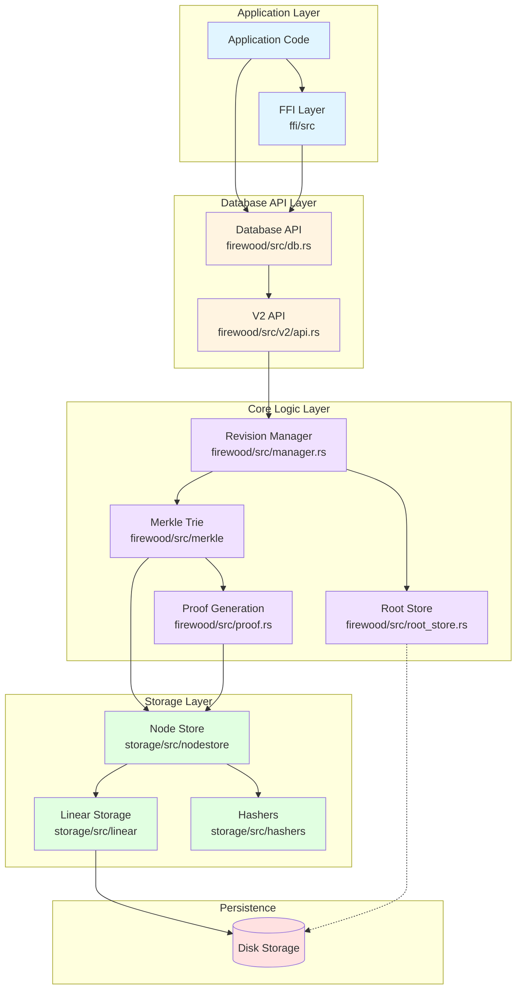

# Firewood: Compaction-Less Database Optimized for Efficiently Storing Recent Merkleized Blockchain State


[](./LICENSE.md)

> :warning: Firewood is beta-level software.
> The Firewood API may change with little to no warning.

Firewood is an embedded key-value store, optimized to store recent Merkleized blockchain
state with minimal overhead. Most blockchains, including Avalanche's C-Chain and Ethereum, store their state in Merkle tries to support efficient generation and verification of state proofs.
Firewood is implemented from the ground up to directly store trie nodes on-disk.
Unlike most state management approaches in the field,
it is not built on top of a generic KV store such as LevelDB/RocksDB.
Firewood, like a B+-tree based database, directly uses the trie structure as the index on-disk.
There is no additional “emulation” of the logical trie to flatten out the data structure
to feed into the underlying database that is unaware of the data being stored.
The convenient byproduct of this approach is that iteration is still fast (for serving state sync queries)
but compaction is not required to maintain the index.
Firewood was first conceived to provide a very fast storage layer for the EVM,
but could be used on any blockchain that requires an authenticated state.

By default, Firewood only attempts to store recent revisions on-disk and will actively clean up unused data when revisions expire.
It keeps some configurable number of previous states in memory and on disk to power state sync and APIs
which may occur at a few roots behind the current state.
To do this, a new root is always created for each revision that can reference either new nodes from this revision or nodes from a prior revision.
When creating a revision,
a list of nodes that are no longer needed are computed and saved to disk in a future-delete log (FDL) as well as kept in memory.
When a revision expires, the nodes that were deleted when it was created are returned to the free space.
Firewood also supports archival mode via `RootStore`, which retains all historical revisions and allows lookup of any past state by its root hash.

Hashes are not used to determine where a node is stored on disk in the database file.
Instead space for nodes may be allocated from the end of the file,
or from space freed from expired revision. Free space management algorithmically resembles that of traditional heap memory management, with free lists used to track different-size spaces that can be reused.
The root address of a node is simply the disk offset within the database file,
and each branch node points to the disk offset of that other node.

Firewood guarantees recoverability by not referencing the new nodes in a new revision before they are flushed to disk,
as well as carefully managing the free list during the creation and expiration of revisions.

## Architecture

Firewood is designed as a layered system where each component has specific responsibilities. The following diagram illustrates the major components and their relationships:



### Component Descriptions

#### Database API Layer

- **Database API** (`firewood/src/db.rs`): The primary interface for interacting with Firewood. Provides methods for creating proposals, committing changes, and querying data.
- **V2 API** (`firewood/src/v2/api.rs`): Modern API surface exposing batch operations, view interfaces, and proof generation capabilities.

#### Core Logic Layer

- **Revision Manager** (`firewood/src/manager.rs`): Manages the lifecycle of revisions, keeping a configurable number of historical states in memory and coordinating proposal creation and commits.
- **Merkle Trie** (`firewood/src/merkle`): Implements the core Merkle Patricia Trie data structure used to organize and hash blockchain state efficiently.
- **Proof Generation** (`firewood/src/proof.rs`, `firewood/src/proofs`): Generates cryptographic proofs including key proofs, range proofs, and change proofs for state verification.
- **Root Store** (`firewood/src/root_store.rs`): Maps root hashes to their corresponding storage addresses, enabling historical revision access.

#### Storage Layer

- **Node Store** (`storage/src/nodestore`): Manages serialization, deserialization, and addressing of trie nodes. Handles free space management using a sophisticated allocation strategy.
- **Linear Storage** (`storage/src/linear`): Provides abstraction over the underlying storage medium (file-backed or in-memory). Nodes are stored at linear addresses (disk offsets).
- **Hashers** (`storage/src/hashers`): Implements different hashing strategies (SHA-256 for MerkleDB compatibility, Keccak-256 for Ethereum compatibility).

#### FFI Layer

- **Foreign Function Interface** (`ffi/src`): Provides C-compatible bindings and Go wrappers, enabling integration with applications written in other languages.

### Data Flow

#### Write Path (Proposal → Commit)

1. Application creates a **Proposal** containing batch operations (puts/deletes)
2. **Revision Manager** creates a new `NodeStore<MutableProposal>` based on the latest committed revision
3. **Merkle Trie** processes batch operations, creating or modifying trie nodes in memory
4. When proposal is committed, **Merkle Trie** computes hashes for all modified nodes
5. **Node Store** assigns disk addresses to new nodes and updates parent references
6. **Linear Storage** persists nodes and metadata to disk
7. **Revision Manager** atomically updates the current root and adds the new committed revision
8. **Root Store** records the mapping from root hash to storage address
9. Old revisions beyond the retention limit are expired, and their space is reclaimed

#### Read Path (Query)

1. Application requests a view at a specific root hash (or latest)
2. **Revision Manager** locates the corresponding committed `NodeStore`
3. Application performs key lookups through the **Database API**
4. **Merkle Trie** traverses the trie structure via **Node Store**
5. **Node Store** reads nodes from **Linear Storage** using cached or disk-based retrieval
6. Values are returned to the application

#### Proof Generation Path

1. Application requests a proof (key proof, range proof, or change proof)
2. **Proof Generation** component traverses the trie via **Merkle Trie**
3. Relevant nodes and their hashes are collected along the path
4. Proof structure is serialized and returned to the application
5. Proofs can be independently verified without access to the database

### Common Operations

#### Read Operation

```text
Application → DB API → Revision Manager → Merkle Trie → Node Store → Linear Storage → Disk
                                                            ↓
                                                      Node Cache (if available)
```

#### Write Operation (Commit)

```text
Application → DB API → Revision Manager → Merkle Trie (hash) → Node Store (allocate) → Linear Storage → Disk
                          ↓
                    Root Store (update mapping)
```

#### Proof Generation

```text
Application → DB API → Proof Generator → Merkle Trie → Node Store → Linear Storage
                                             ↓
                                    Collect proof nodes and hashes
```

For a visual representation, see the [architecture diagram](./docs/assets/architecture.svg).

## Terminology

- `Revision` - A historical point-in-time state/version of the trie. This
  represents the entire trie, including all `Key`/`Value`s at that point
  in time, and all `Node`s.
- `View` - This is the interface to read from a `Revision` or a `Proposal`.
- `Node` - A node is a portion of a trie. A trie consists of nodes that are linked
  together. Nodes can point to other nodes and/or contain `Key`/`Value` pairs.
- `Hash` - In this context, this refers to the merkle hash for a specific node.
- `Root Hash` - The hash of the root node for a specific revision.
- `Key` - Represents an individual byte array used to index into a trie. A `Key`
  usually has a specific `Value`.
- `Value` - Represents a byte array for the value of a specific `Key`. Values can
  contain 0-N bytes. In particular, a zero-length `Value` is valid.
- `Key Proof` - A proof that a `Key` exists within a specific revision of a trie.
  This includes the hash for the node containing the `Key` as well as all parents.
- `Range Proof` - A proof that consists of two `Key Proof`s, one for the start of
  the range, and one for the end of the range, as well as a list of all `Key`/`Value`
  pairs in between the two. A `Range Proof` can be validated independently of an
  actual database by constructing a trie from the `Key`/`Value`s provided.
- `Change Proof` - A proof that consists of a set of all changes between two
  revisions.
- `Put` - An operation for a `Key`/`Value` pair. A put means "create if it doesn't
  exist, or update it if it does. A put operation is how you add a `Value` for a
  specific `Key`.
- `Delete` - An operation indicating that a `Key` should be removed from the trie.
- `Batch Operation` - An operation of either `Put` or `Delete`.
- `Batch` - An ordered set of `Batch Operation`s.
- `Proposal` - A proposal consists of a base `Root Hash` and a `Batch`, but is not
  yet committed to the trie. In Firewood's most recent API, a `Proposal` is required
  to `Commit`.
- `Commit` - The operation of applying one or more `Proposal`s to the most recent
  `Revision`.

## Metrics

Firewood provides comprehensive metrics for monitoring database performance, resource utilization, and operational characteristics. For detailed information about all available metrics, how to enable them, and how to interpret them, see [METRICS.md](METRICS.md).

## Build

In order to build firewood, the following dependencies must be installed:

- `protoc` See [installation instructions](https://grpc.io/docs/protoc-installation/).
- `cargo` See [installation instructions](https://doc.rust-lang.org/cargo/getting-started/installation.html).
- `make` See [download instructions](https://www.gnu.org/software/make/#download) or run `sudo apt install build-essential` on Linux.

More detailed build instructions, including some scripts,
can be found in the [benchmark setup scripts](benchmark/setup-scripts).

If you want to build and test the ffi layer for another platform,
you can find those instructions in the [ffi README](ffi/README.md).

## Ethereum compatibility

By default, Firewood builds with hashes compatible with [merkledb](https://github.com/ava-labs/avalanchego/tree/master/x/merkledb),
and does not support accounts.
To enable this feature (at the cost of some performance) enable the ethhash [feature flag](https://doc.rust-lang.org/cargo/reference/features.html#command-line-feature-options).

Enabling this feature
changes the hashing algorithm from [sha256](https://docs.rs/sha2/latest/sha2/type.Sha256.html)
to [keccak256](https://docs.rs/sha3/latest/sha3/type.Keccak256.html),
understands that an "account" is actually just a node in the storage tree at a specific depth with a specific RLP-encoded value,
and computes the hash of the account trie as if it were an actual root.

It is worth noting that the hash stored as a value inside the account root RLP is not used.
During hash calculations, we know the hash of the children,
and use that directly to modify the value in-place
when hashing the node.
See [replace\_hash](firewood/storage/src/hashers/ethhash.rs) for more details.

## Run

Example(s) are in the [examples](firewood/examples) directory, that simulate real world
use-cases. Try running the insert example via the command-line, via `cargo run --release
--example insert`.

There is a [fwdctl cli](fwdctl) for command-line operations on a database.

There is also a [benchmark](benchmark) that shows some other example uses.

For maximum runtime performance at the cost of compile time,
use `cargo run --maxperf` instead,
which enables maximum link time compiler optimizations.

## Logging

If you want logging, enable the `logging` feature flag, and then set RUST\_LOG accordingly.
See the documentation for [env\_logger](https://docs.rs/env_logger/latest/env_logger/) for specifics.
We currently have very few logging statements, but this is useful for print-style debugging.

## Release

See the [release documentation](./RELEASE.md) for detailed information on how to
release Firewood.

## Supported Platforms

Firewood follows the same compatibility matrix as [AvalancheGo](https://github.com/ava-labs/avalanchego?tab=readme-ov-file#supported-platforms).

## CLI

Firewood comes with a CLI tool called `fwdctl` that enables one to create and interact with a local instance of a Firewood database. For more information, see the [fwdctl README](fwdctl/README.md).

## Test

```sh
cargo nextest --release
```

## License

Firewood is licensed by the Ecosystem License. For more information, see the
[LICENSE file](./LICENSE.md).
