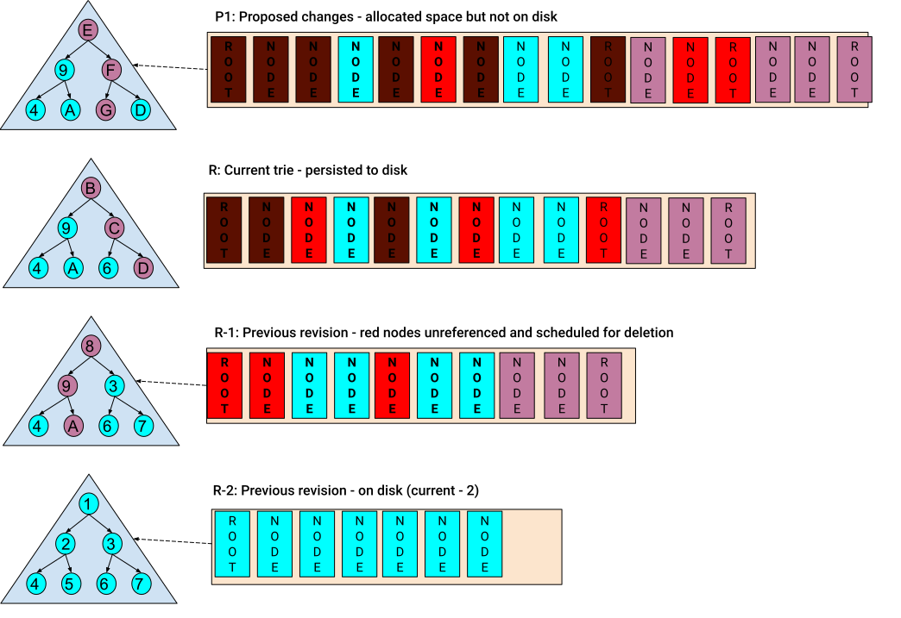

# Firewood: Compaction-Less Database Optimized for Efficiently Storing Recent Merkleized Blockchain State


[](./LICENSE.md)

> :warning: Firewood is beta-level software.
> The Firewood API may change with little to no warning.

Firewood is an embedded key-value store, optimized to store recent Merkleized blockchain
state with minimal overhead. Most blockchains, including Avalanche's C-Chain and Ethereum, store their state in Merkle tries to support efficient generation and verification of state proofs.
Firewood is implemented from the ground up to directly store trie nodes on-disk.
Unlike most state management approaches in the field,
it is not built on top of a generic KV store such as LevelDB/RocksDB.
Firewood, like a B+-tree based database, directly uses the trie structure as the index on-disk.
There is no additional “emulation” of the logical trie to flatten out the data structure
to feed into the underlying database that is unaware of the data being stored.
The convenient byproduct of this approach is that iteration is still fast (for serving state sync queries)
but compaction is not required to maintain the index.
Firewood was first conceived to provide a very fast storage layer for the EVM,
but could be used on any blockchain that requires an authenticated state.

Firewood only attempts to store recent revisions on-disk and will actively clean up unused data when revisions expire.
Firewood keeps some configurable number of previous states in memory and on disk to power state sync and APIs
which may occur at a few roots behind the current state.
To do this, a new root is always created for each revision that can reference either new nodes from this revision or nodes from a prior revision.
When creating a revision,
a list of nodes that are no longer needed are computed and saved to disk in a future-delete log (FDL) as well as kept in memory.
When a revision expires, the nodes that were deleted when it was created are returned to the free space.

Hashes are not used to determine where a node is stored on disk in the database file.
Instead space for nodes may be allocated from the end of the file,
or from space freed from expired revision. Free space management algorithmically resembles that of traditional heap memory management, with free lists used to track different-size spaces that can be reused.
The root address of a node is simply the disk offset within the database file,
and each branch node points to the disk offset of that other node.

Firewood guarantees recoverability by not referencing the new nodes in a new revision before they are flushed to disk,
as well as carefully managing the free list during the creation and expiration of revisions.

## Architecture Diagram



## Terminology

- `Revision` - A historical point-in-time state/version of the trie. This
  represents the entire trie, including all `Key`/`Value`s at that point
  in time, and all `Node`s.
- `View` - This is the interface to read from a `Revision` or a `Proposal`.
- `Node` - A node is a portion of a trie. A trie consists of nodes that are linked
  together. Nodes can point to other nodes and/or contain `Key`/`Value` pairs.
- `Hash` - In this context, this refers to the merkle hash for a specific node.
- `Root Hash` - The hash of the root node for a specific revision.
- `Key` - Represents an individual byte array used to index into a trie. A `Key`
  usually has a specific `Value`.
- `Value` - Represents a byte array for the value of a specific `Key`. Values can
  contain 0-N bytes. In particular, a zero-length `Value` is valid.
- `Key Proof` - A proof that a `Key` exists within a specific revision of a trie.
  This includes the hash for the node containing the `Key` as well as all parents.
- `Range Proof` - A proof that consists of two `Key Proof`s, one for the start of
  the range, and one for the end of the range, as well as a list of all `Key`/`Value`
  pairs in between the two. A `Range Proof` can be validated independently of an
  actual database by constructing a trie from the `Key`/`Value`s provided.
- `Change Proof` - A proof that consists of a set of all changes between two
  revisions.
- `Put` - An operation for a `Key`/`Value` pair. A put means "create if it doesn't
  exist, or update it if it does. A put operation is how you add a `Value` for a
  specific `Key`.
- `Delete` - An operation indicating that a `Key` should be removed from the trie.
- `Batch Operation` - An operation of either `Put` or `Delete`.
- `Batch` - An ordered set of `Batch Operation`s.
- `Proposal` - A proposal consists of a base `Root Hash` and a `Batch`, but is not
  yet committed to the trie. In Firewood's most recent API, a `Proposal` is required
  to `Commit`.
- `Commit` - The operation of applying one or more `Proposal`s to the most recent
  `Revision`.

## Metrics

Firewood provides comprehensive metrics for monitoring database performance, resource utilization, and operational characteristics. These metrics are built using the [Prometheus](https://prometheus.io/) format and can be exposed for collection by monitoring systems.

**Note**: Metric names in this documentation use dots (e.g., `firewood.proposal.commit`), but when exported to Prometheus, dots are automatically converted to underscores (e.g., `firewood_proposal_commit`) following Prometheus naming conventions.

### Enabling Metrics

Metrics are available when Firewood is built with the `metrics` feature. By default, metrics collection is enabled in the library but needs to be explicitly started in applications.

#### For Rust Applications

Metrics are automatically registered when the instrumented code paths are executed. To expose metrics via HTTP:

```rust
use metrics_exporter_prometheus::PrometheusBuilder;

// Set up Prometheus exporter on port 9000
PrometheusBuilder::new()
    .install()
    .expect("failed to install Prometheus recorder");
```

#### For FFI/Go Applications

In the Go FFI layer, metrics must be explicitly enabled:

```go
import "github.com/ava-labs/firewood-go-ethhash/ffi"

// Option 1: Start metrics with HTTP exporter on a specific port
ffi.StartMetricsWithExporter(9000)

// Option 2: Start metrics without exporter (use Gatherer to access)
ffi.StartMetrics()

// Retrieve metrics programmatically
gatherer := ffi.Gatherer{}
metrics, err := gatherer.Gather()
```

See the [FFI README](ffi/README.md) for more details on FFI metrics configuration.

### Available Metrics

#### Database Operations

##### Proposal Metrics

- **`firewood.proposals`** (counter)
  - Description: Total number of proposals created
  - Use: Track proposal creation rate and throughput

- **`firewood.proposal.create`** (counter with `success` label)
  - Description: Count of proposal creation operations
  - Labels: `success=true|false`
  - Use: Monitor proposal creation success rate

- **`firewood.proposal.create_ms`** (counter with `success` label)
  - Description: Time spent creating proposals in milliseconds
  - Labels: `success=true|false`
  - Use: Track proposal creation latency

- **`firewood.proposal.commit`** (counter with `success` label)
  - Description: Count of proposal commit operations
  - Labels: `success=true|false`
  - Use: Monitor commit success rate

- **`firewood.proposal.commit_ms`** (counter with `success` label)
  - Description: Time spent committing proposals in milliseconds
  - Labels: `success=true|false`
  - Use: Track commit latency and identify slow commits

##### Revision Management

- **`firewood.active_revisions`** (gauge)
  - Description: Current number of active revisions in memory
  - Use: Monitor memory usage and revision retention

- **`firewood.max_revisions`** (gauge)
  - Description: Maximum number of revisions configured
  - Use: Track configuration setting

#### Merkle Trie Operations

##### Insert Operations

- **`firewood.insert`** (counter with `merkle` label)
  - Description: Count of insert operations by type
  - Labels: `merkle=update|above|below|split`
    - `update`: Value updated at existing key
    - `above`: New node inserted above existing node
    - `below`: New node inserted below existing node
    - `split`: Node split during insertion
  - Use: Understand insert patterns and trie structure evolution

##### Remove Operations

- **`firewood.remove`** (counter with `prefix` and `result` labels)
  - Description: Count of remove operations
  - Labels:
    - `prefix=true|false`: Whether operation is prefix-based removal
    - `result=success|nonexistent`: Whether key(s) were found
  - Use: Track deletion patterns and key existence

#### Storage and I/O Metrics

##### Node Reading

- **`firewood.read_node`** (counter with `from` label)
  - Description: Count of node reads by source
  - Labels: `from=file|memory`
  - Use: Monitor read patterns and storage layer usage

##### Cache Performance

- **`firewood.cache.node`** (counter with `mode` and `type` labels)
  - Description: Node cache hit/miss statistics
  - Labels:
    - `mode`: Read operation mode
    - `type=hit|miss`: Cache hit or miss
  - Use: Evaluate cache effectiveness for nodes

- **`firewood.cache.freelist`** (counter with `type` label)
  - Description: Free list cache hit/miss statistics
  - Labels: `type=hit|miss`
  - Use: Monitor free list cache efficiency

##### I/O Operations

- **`firewood.io.read`** (counter)
  - Description: Total number of I/O read operations
  - Use: Track I/O operation count

- **`firewood.io.read_ms`** (counter)
  - Description: Total time spent in I/O reads in milliseconds
  - Use: Identify I/O bottlenecks and disk performance issues

##### Node Persistence

- **`firewood.flush_nodes`** (counter)
  - Description: Cumulative time spent flushing nodes to disk in milliseconds (counter incremented by flush duration)
  - Use: Monitor flush performance and identify slow disk writes; calculate average flush time using rate()

#### Memory Management

##### Space Allocation

- **`firewood.space.reused`** (counter with `index` label)
  - Description: Bytes reused from free list
  - Labels: `index`: Size index of allocated area
  - Use: Track memory reuse efficiency

- **`firewood.space.wasted`** (counter with `index` label)
  - Description: Bytes wasted when allocating from free list (allocated more than needed)
  - Labels: `index`: Size index of allocated area
  - Use: Monitor allocation efficiency and fragmentation

- **`firewood.space.from_end`** (counter with `index` label)
  - Description: Bytes allocated from end of nodestore when free list was insufficient
  - Labels: `index`: Size index of allocated area
  - Use: Track database growth and free list effectiveness

- **`firewood.space.freed`** (counter with `index` label)
  - Description: Bytes freed back to free list
  - Labels: `index`: Size index of freed area
  - Use: Monitor memory reclamation

##### Node Management

- **`firewood.delete_node`** (counter with `index` label)
  - Description: Count of nodes deleted
  - Labels: `index`: Size index of deleted node
  - Use: Track node deletion patterns

##### Ring Buffer

- **`ring.full`** (counter)
  - Description: Count of times the ring buffer became full during node flushing
  - Use: Identify backpressure in node persistence pipeline

#### FFI Layer Metrics

These metrics are specific to the Foreign Function Interface (Go) layer:

##### Batch Operations

- **`firewood.ffi.batch`** (counter)
  - Description: Count of batch operations completed
  - Use: Track FFI batch throughput

- **`firewood.ffi.batch_ms`** (counter)
  - Description: Time spent processing batches in milliseconds
  - Use: Monitor FFI batch latency

##### Proposal Operations

- **`firewood.ffi.propose`** (counter)
  - Description: Count of proposal operations via FFI
  - Use: Track FFI proposal throughput

- **`firewood.ffi.propose_ms`** (counter)
  - Description: Time spent creating proposals via FFI in milliseconds
  - Use: Monitor FFI proposal latency

##### Commit Operations

- **`firewood.ffi.commit`** (counter)
  - Description: Count of commit operations via FFI
  - Use: Track FFI commit throughput

- **`firewood.ffi.commit_ms`** (counter)
  - Description: Time spent committing via FFI in milliseconds
  - Use: Monitor FFI commit latency

##### View Caching

- **`firewood.ffi.cached_view.hit`** (counter)
  - Description: Count of cached view hits
  - Use: Monitor view cache effectiveness

- **`firewood.ffi.cached_view.miss`** (counter)
  - Description: Count of cached view misses
  - Use: Monitor view cache effectiveness

### Interpreting Metrics

#### Performance Monitoring

1. **Latency Tracking**: The `*_ms` metrics track operation durations. Monitor these for:
   - Sudden increases indicating performance degradation
   - Baseline establishment for SLA monitoring
   - Correlation with system load

2. **Throughput Monitoring**: Counter metrics without `_ms` suffix track operation counts:
   - Rate of change indicates throughput
   - Compare with expected load patterns
   - Identify anomalies in operation rates

#### Resource Utilization

1. **Cache Efficiency**:
   - Calculate hit rate: `cache.hit / (cache.hit + cache.miss)`
   - Target: >90% for node cache, >80% for free list cache
   - Low hit rates may indicate insufficient cache size

2. **Memory Management**:
   - Monitor `space.reused` vs `space.from_end` ratio
   - High `space.from_end` indicates database growth
   - High `space.wasted` suggests fragmentation issues

3. **Active Revisions**:
   - `active_revisions` approaching `max_revisions` triggers cleanup
   - Sustained high values may indicate memory pressure

#### Debugging

1. **Failed Operations**:
   - Check metrics with `success=false` label
   - Correlate with error logs for root cause analysis

2. **Ring Buffer Backpressure**:
   - `ring.full` counter increasing indicates persistence bottleneck
   - May require tuning of flush parameters or disk subsystem

3. **Insert/Remove Patterns**:
   - `firewood.insert` labels show trie structure evolution
   - High `split` counts indicate complex key distributions
   - Remove `nonexistent` suggests application-level issues

### Example Monitoring Queries

For Prometheus-based monitoring (note: metric names use underscores in queries):

```promql
# Average commit latency over 5 minutes
rate(firewood_proposal_commit_ms[5m]) / rate(firewood_proposal_commit[5m])

# Cache hit rate
sum(rate(firewood_cache_node{type="hit"}[5m])) / 
sum(rate(firewood_cache_node[5m]))

# Database growth rate (bytes/sec)
rate(firewood_space_from_end[5m])

# Failed commit ratio
rate(firewood_proposal_commit{success="false"}[5m]) / 
rate(firewood_proposal_commit[5m])
```

## Build

In order to build firewood, the following dependencies must be installed:

- `protoc` See [installation instructions](https://grpc.io/docs/protoc-installation/).
- `cargo` See [installation instructions](https://doc.rust-lang.org/cargo/getting-started/installation.html).
- `make` See [download instructions](https://www.gnu.org/software/make/#download) or run `sudo apt install build-essential` on Linux.

More detailed build instructions, including some scripts,
can be found in the [benchmark setup scripts](benchmark/setup-scripts).

If you want to build and test the ffi layer for another platform,
you can find those instructions in the [ffi README](ffi/README.md).

## Ethereum compatibility

By default, Firewood builds with hashes compatible with [merkledb](https://github.com/ava-labs/avalanchego/tree/master/x/merkledb),
and does not support accounts.
To enable this feature (at the cost of some performance) enable the ethhash [feature flag](https://doc.rust-lang.org/cargo/reference/features.html#command-line-feature-options).

Enabling this feature
changes the hashing algorithm from [sha256](https://docs.rs/sha2/latest/sha2/type.Sha256.html)
to [keccak256](https://docs.rs/sha3/latest/sha3/type.Keccak256.html),
understands that an "account" is actually just a node in the storage tree at a specific depth with a specific RLP-encoded value,
and computes the hash of the account trie as if it were an actual root.

It is worth noting that the hash stored as a value inside the account root RLP is not used.
During hash calculations, we know the hash of the children,
and use that directly to modify the value in-place
when hashing the node.
See [replace\_hash](firewood/storage/src/hashers/ethhash.rs) for more details.

## Run

Example(s) are in the [examples](firewood/examples) directory, that simulate real world
use-cases. Try running the insert example via the command-line, via `cargo run --release
--example insert`.

There is a [fwdctl cli](fwdctl) for command-line operations on a database.

There is also a [benchmark](benchmark) that shows some other example uses.

For maximum runtime performance at the cost of compile time,
use `cargo run --maxperf` instead,
which enables maximum link time compiler optimizations.

## Logging

If you want logging, enable the `logging` feature flag, and then set RUST\_LOG accordingly.
See the documentation for [env\_logger](https://docs.rs/env_logger/latest/env_logger/) for specifics.
We currently have very few logging statements, but this is useful for print-style debugging.

## Release

See the [release documentation](./RELEASE.md) for detailed information on how to release Firewood.

## CLI

Firewood comes with a CLI tool called `fwdctl` that enables one to create and interact with a local instance of a Firewood database. For more information, see the [fwdctl README](fwdctl/README.md).

## Test

```sh
cargo test --release
```

## License

Firewood is licensed by the Ecosystem License. For more information, see the
[LICENSE file](./LICENSE.md).
