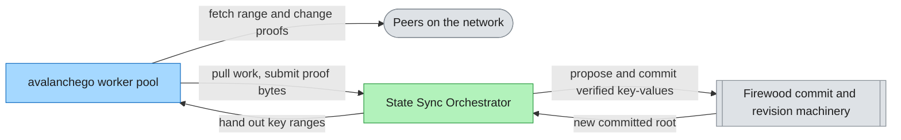
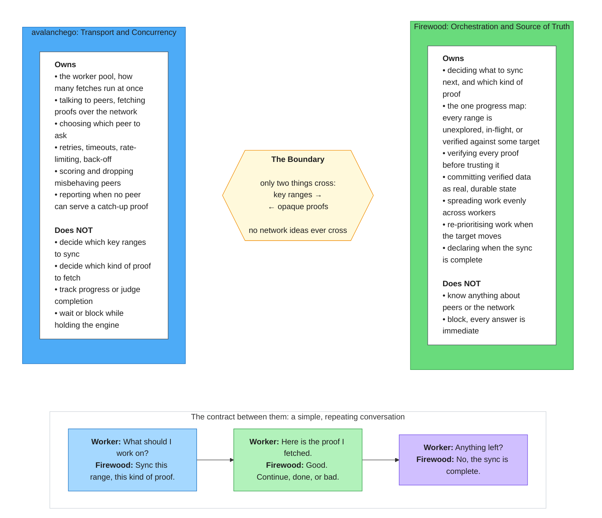
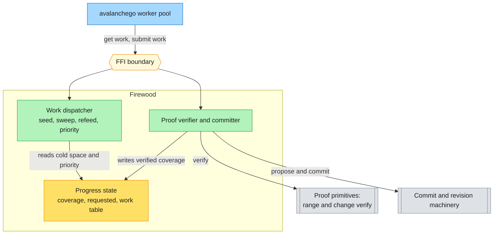
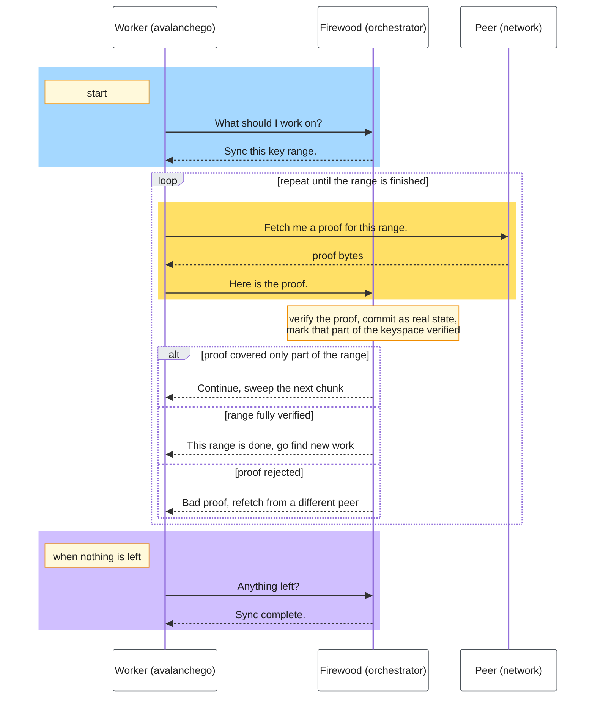
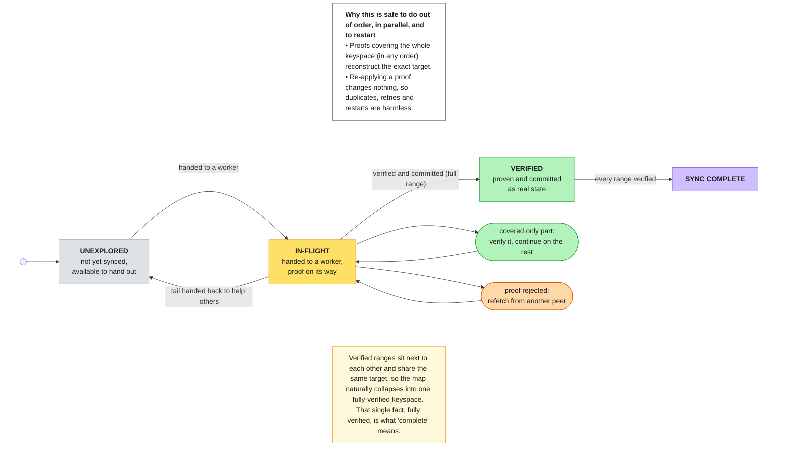
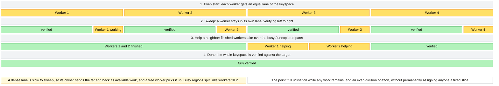
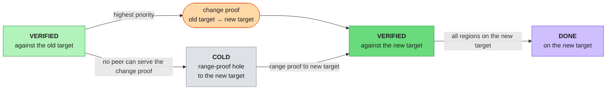
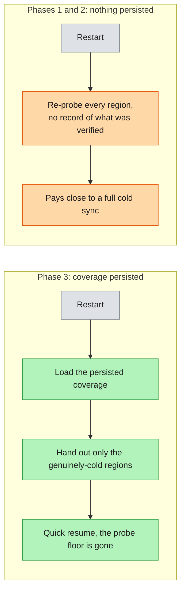
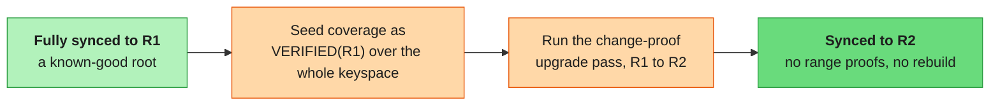

# State Sync: High-Level Design

An architectural guide to moving trie-aware sync orchestration into Firewood. It
presents the architecture once, then maps what each delivery phase adds, with
diagrams specific to each phase's enhancements. A reader should finish able to
predict where each responsibility lives and why.

Terms in `Code` font are defined in the Key terms section at the end. Deeper
implementation mechanics and the commit-by-commit sequence live in the companion
plan documents.

## 1. Overview

State sync brings a node up to a network's current Merkleized state by fetching
and verifying it from peers. This design moves the trie-aware orchestration of
that process out of avalanchego and into Firewood, while Firewood stays
completely ignorant of the network. Firewood decides which key ranges to sync,
verifies each `Range Proof` or `Change Proof`, and commits the result as real
`Revision`s. avalanchego fetches the bytes and runs the workers.

The reason is not only cleaner layering. Today progress is spread across several
locks, so no single place answers "is the sync done, or is it being retargeted".
Making Firewood the one owner of progress means completion and any target change
are decided against one consistent state behind one lock, which turns today's
flaky moving-target races into defined outcomes.

**Design goals (the invariants the design commits to):**

- **No network knowledge in Firewood.** The boundary carries only key ranges out
  and opaque proof bytes in. Peers, retries, and timeouts never cross it.
- **One source of truth for progress.** All keyspace bookkeeping lives on the
  Firewood side. avalanchego holds only a handle and its outstanding work IDs.
- **Commit real revisions.** Verified proofs become committed `Revision`s through
  Firewood's normal machinery. No provisional or special-cased sync state.
- **No blocking across the boundary.** Every Firewood call returns immediately.
  All waiting happens on the avalanchego side.
- **Keep every worker busy, split work evenly.** Full utilisation while cold work
  remains, divided as evenly as the key distribution allows, without fixed
  partitioning.
- **Reuse existing primitives.** This is an orchestration layer over existing
  range and change proof verification and the commit path, not new trie
  machinery.

**System context.** The orchestrator sits between the worker pool and Firewood's
existing commit machinery. Only those two touch it. Peers are reached only
through the workers.

## 2. Architecture

The foundation every phase shares.

### Roles and ownership

Firewood decides and verifies, avalanchego fetches and runs the workers, and
only key ranges and opaque proof bytes cross between them.

### Components

Four components carry the design. Three live inside Firewood, one in avalanchego.
They depend in one direction: the worker pool drives the boundary, the boundary
drives the dispatcher and the verifier, and both of those read and write the
progress state.

**Progress state.** The single source of truth for where the sync stands.

| Field | Content |
| --- | --- |
| **Role** | Hold the authoritative record of sync progress |
| **Responsibilities** | Track every keyspace point as `Verified` against a hash, `Requested`, or `Cold`. Answer "what cold space is left" and "is this region occupied" |
| **Owns** | The `Coverage` map (verified ranges by the hash each was verified against), the requested set, and the per-worker work table |
| **Depends on** | Nothing. It is read and written by the other two Firewood components |
| **Does not** | Talk to the network, verify proofs, or decide priority. It only records facts |

**Work dispatcher.** Decides what each worker does next.

| Field | Content |
| --- | --- |
| **Role** | Turn progress state into the next unit of work for a worker |
| **Responsibilities** | Seed an even split up front, keep a worker sweeping its own `Region`, refeed idle workers onto the largest `Hole`, and after a `Pivot` hand out the highest-priority work first |
| **Owns** | The hole-selection and priority policy |
| **Depends on** | Progress state, to see cold space and per-region target hashes |
| **Does not** | Verify or commit anything, or choose peers. It hands out ranges, not proofs |

**Proof verifier and committer.** Turns fetched bytes into committed state.

| Field | Content |
| --- | --- |
| **Role** | Verify a submitted proof and commit what it proves |
| **Responsibilities** | Verify a `Range Proof` or `Change Proof` against the hash its `Region` was issued for, commit the verified key-values as a `Revision`, then update coverage and compute the resume point |
| **Owns** | The verify-then-commit pipeline and the verified-coverage update |
| **Depends on** | The proof primitives (to verify and find the resume point) and the commit machinery (to make a real `Revision`) |
| **Does not** | Choose peers, retry, or score them. A bad proof is reported back, not handled |

**avalanchego worker pool.** Transport and concurrency.

| Field | Content |
| --- | --- |
| **Role** | Fetch proofs and run a fixed pool of workers |
| **Responsibilities** | Run `task_limit` `Worker`s, fetch the proof Firewood asks for, submit it back, park and wake on a condition variable, choose and score peers |
| **Owns** | The goroutine pool, peer selection, retries, timeouts, and back-off |
| **Depends on** | The FFI boundary, for work to do and verdicts on proofs |
| **Does not** | Decide ranges, decide proof kind, track progress, or block inside an FFI call |

### The pull-based contract

One seam joins the two sides: a small set of FFI calls, used pull-based. The
worker pool always initiates. Firewood only ever answers, synchronously and
without ever blocking. The work-handing call is a pure function of durable
progress state, so it is safe to call again and to re-check in a loop. The submit
call verifies, commits, and updates coverage as one step. Because proofs are
idempotent, re-submitting the same proof is a harmless no-op, which makes
duplicates, timeout-then-refetch, and restart safe with no special handling.
Proof bytes are untrusted until the verifier checks them against the target.

Workers that find no work park on a condition variable and are woken when work
appears. The rule that prevents a lost wakeup is to evaluate the work-handing
call and the park under the same lock the signaller takes. Because that call is a
pure function of durable state, this is safe, and the whole mechanism lives on
the avalanchego side. Firewood neither knows nor cares.

## 3. How a sync runs

The base behaviour, which is what Phase 1 delivers.

### The lifecycle of one key range

Every slice of the keyspace moves through three states. Two self-loops and one
hand-back are the only real transitions. When every slice is `Verified` against
the target, the `Coverage` map collapses to one fully-verified keyspace, and that
single fact is completion.

**Completion and failure modes.** The sync is complete when the latest committed
root equals the target, checked cheaply on each work-handing call. A **bad proof**
leaves the region reserved under the same work ID, so the same worker refetches
the identical range from a different peer. A **duplicate or stale work ID** is
harmless, since the second submit finds no work entry and is dropped. An
**internal error** is a distinct result with no state change. A **full-coverage
but wrong-root** condition is impossible in normal operation and is surfaced as a
unique error code, recognisable as an internal invariant violation.

### Keeping every worker busy

The dispatcher starts each worker on an even slice, keeps it sweeping its own
lane, and refeeds finished workers onto whoever is still behind. A dense lane
sheds its far end as available work and a free worker picks it up, so the pool
stays fully utilised while any work remains, with no fixed partitioning. Each row
below is the whole keyspace, divided into proportional segments.

## 4. Phased delivery: what each phase adds

The design is one effort, sequenced into three phases so each ships
independently. The data structures are shaped end-to-end for the whole design,
so no early work is throwaway. The per-region hash in `Coverage`, for example,
exists from Phase 1 precisely so Phase 2 can tell which `Change Proof` a region
needs.

### Phase 1: static range-proof core (the foundation)

**What it delivers:** everything in sections 2 and 3. The four control-surface
operations (start sync, get work, submit work, finish sync), a single fixed
target, and range proofs only. The whole orchestration layer is new Firewood
code (the coverage map, the work table, hole selection) plus the avalanchego
fixed park-and-wake pool. This is the bulk of the net-new work.

**What it excludes,** carried to later phases: moving the target, change proofs,
the work-item kind, persisted coverage, and a smart resume that skips
already-synced ranges. A restart in Phase 1 starts over, which is always correct
because range proofs are idempotent.

### Phase 2: pivoting and change proofs

A live chain advances, so the target moves. Rather than restart, Firewood
**re-prioritises** the existing `Coverage`. This phase adds a `Pivot` to a new
target, change proofs, a kind on every work item (range or change, with the from
hash for change work), a dispatch priority, and the catch-up-unavailable signal.
The control flow is unchanged. Only which work is most urgent changes.

The keyspace is re-prioritised in place. Regions already verified against the old
target are lifted first with cheap change proofs, before the old target ages out
of what peers can serve. In-progress lanes keep sweeping, and never-synced holes
are discovered last.

```mermaid
%%{init: {'theme':'base'}}%%
block-beta
  columns 20
  h1["The progress map remembers which target each part was verified against"]:20
  m1["already verified (old target)"]:5 m2["never synced"]:5 m3["already verified (old target)"]:4 m4["verified (new target)"]:3 m5["never synced"]:3
  h2["What each part needs, in priority order"]:20
  p1["1. Verified against the OLD target  →  cheap catch-up proof to the new target  (do first)"]:12 w1["Why catch-up first?  The old target is about to age out of what peers can still answer."]:8
  p2["2. A worker's own in-progress lane  →  keep sweeping it"]:12 w2["Safety net, never stuck.  If no peer can serve a catch-up proof, that region drops back to a normal full sync against the current target."]:8
  p3["3. Never synced  →  full sync to the new target  (do last)"]:12 w3["A full sync always works and is always correct. Catch-up is only an optimisation on top of it."]:8
  banner["Roles do not change. The worker pool is the same size. Nobody is spawned or killed. A moving target is only a reshuffle of which work is most urgent."]:20
  classDef verifiedold fill:#b2f2bb,stroke:#2f9e44,color:#1e1e1e
  classDef verifiednew fill:#69db7c,stroke:#2f9e44,color:#1e1e1e
  classDef unexplored fill:#dee2e6,stroke:#868e96,color:#1e1e1e
  classDef catchup fill:#ffd8a8,stroke:#e8590c,color:#1e1e1e
  classDef inflight fill:#ffe066,stroke:#f08c00,color:#1e1e1e
  classDef note fill:#fff9db,stroke:#f08c00,color:#1e1e1e
  classDef white fill:#ffffff,stroke:#495057,color:#1e1e1e
  classDef fw fill:#b2f2bb,stroke:#69db7c,color:#1e1e1e
  classDef title fill:#f1f3f5,stroke:#dee2e6,color:#1971c2
  class h1,h2 title
  class m1,m3 verifiedold
  class m2,m5 unexplored
  class m4 verifiednew
  class p1 catchup
  class p2 inflight
  class p3 unexplored
  class w1 white
  class w2 note
  class w3 white
  class banner fw
```

The region lifecycle gains a path. A region `Verified` against the old target is
no longer terminal: it is lifted to the new target with a `Change Proof` at the
highest priority, or, if no peer can serve that proof, it drops back to a cold
range-proof hole against the new target. Either path reaches verified against the
new target.

Three properties keep a pivot cheap. **Multi-pivot** is supported: a second pivot
can land before every region has upgraded, so `Coverage` may hold several
historical hashes at once, each region knowing which one its change proof must
request against. A request **already in flight** when the pivot lands still
commits as verified against the old target, true and already paid for, then
becomes upgrade work queued behind that commit. And **no revision pinning** is
needed, because a change proof verifies against the region's current contents, so
the old target revision need not be retained. The safety net throughout is the
**liveness floor**: a range proof against the current target is always
serviceable, so the worst case of any expiry is to re-range-proof a region, never
to be stuck.

### Phase 3: durability and optimization

Phase 3 makes `Coverage` durable and tunes the system. These are cost and tuning
levers, revisited once the core runs and there are measurements.

**Persist coverage to kill the warm-restart cost.** In Phases 1 and 2 nothing is
persisted, so a restart re-probes every region. Persisting `Coverage` lets a
near-complete restart resume with a nearly-complete map and hand out only the
genuinely-cold regions.

**Known-good advance.** The same durable-coverage lever, plus the Phase 2 change-
proof upgrade machinery, lets a node already synced to a known-good root advance
to a newer one with no range proofs and no rebuild. Seed `Coverage` as verified
against the known-good root over the whole keyspace, then run the change-proof
upgrade pass to the new root.

**Other Phase 3 levers,** no diagram needed. A smarter resume point skips an
already-synced range in about one probe instead of re-fetching it chunk by chunk,
bounding a warm restart even before coverage is persisted. Metrics export
coverage percentage, outstanding count, and verification counters. Tuning covers
the proof size bound and batching several proofs into one commit to reduce
revision churn.

## 5. Cross-cutting concerns

**Consistency model.** Progress is single-owner. Completion and any `Pivot` are
decided against one consistent progress state behind one lock, so a target change
that races completion has one defined outcome instead of a timing-dependent hang.
Verified data is committed as real `Revision`s, never held as provisional sync
state, so there is no second consistency surface to reconcile.

**Trust and security.** Every proof is untrusted until the verifier checks it
against the target. A failed check is attributed to the peer and surfaced as a
distinct result, the only peer-shaped signal Firewood produces. The inverse
signal, "no peer can serve this change proof", flows the other way and demotes a
region to a range hole.

**Recoverability.** The orchestration commits forward onto the latest root and
never reads back its own intermediate sync revisions, so the `Revision Manager`
reaping old revisions mid-flight cannot dangle anything it holds. An abandoned
sync leaves real but incomplete revisions that fall off the back of the window
like any other, and a later restart reuses the on-disk nodes they wrote as a warm
start. This rests on Firewood's disk-offset addressing, where a node's address is
its byte offset in the database file and a new node is never referenced before it
is flushed, so a crash always recovers to a consistent revision.

## 6. Key terms

- **Target** - The root hash the sync is driving toward. Fixed in Phase 1, made
  movable by a `Pivot` in Phase 2.
- **Coverage** - The authoritative map of which key ranges are verified and
  against which hash. The hash is stored per region, so after a `Pivot` a range
  can record a historical hash that still owes a change-proof upgrade.
- **Region** - A half-open key range handed out as one unit of sync work.
- **Hole** - A maximal contiguous run of `Cold` keyspace, the raw material work
  is carved from.
- **Verified / Requested / Cold** - The three states of any keyspace point:
  proven against a target hash, currently handed out, or available to hand out.
- **Worker** - One goroutine in the fixed avalanchego pool. It acquires a
  `Region`, sweeps it, then continues on it or helps a neighbor. The worker count
  is the task limit, the effective parallelism.
- **Pivot** - Switching the `Target` mid-flight to a newer root, which
  re-prioritises existing `Coverage` instead of restarting.
- **Range Proof** - A proof over a contiguous key range, verifiable against a
  root hash without the database. The unit of range work.
- **Change Proof** - A proof of the changes between two revisions. It verifies
  against the source root, the target root, or any intermediate mix, which makes
  it idempotent.
- **Proposal, Commit, Revision** - A proposal is a batch of key-value changes on
  a base root. Committing it produces a revision, an immutable point-in-time
  state named by its `Root Hash`.
- **Revision Manager** - The owner of the bounded window of recent revisions. It
  expires old revisions and recycles their storage through the free list.
