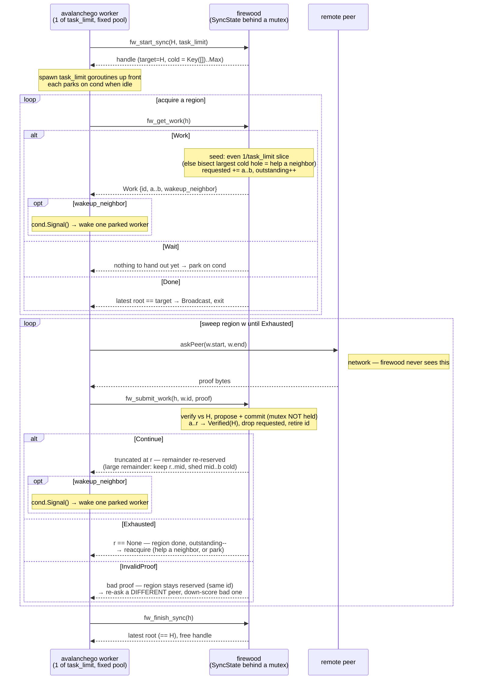

# State Sync: migrating avalanchego `database/merkle/sync` orchestration into Firewood

**Status:** Draft / iterating
**Scope:** The complete design — static range-proof sync to a fixed target *and*
dynamic-target [pivoting](#pivoting-dynamic-target-fw_pivot) with **change proofs**. Both are
part of this effort. Delivery is **phased**, not partial: **Phase 1** (referred to as **"v1"**
throughout this doc) implements and commits the static range-proof core toward a single fixed
target; **Phase 2** adds pivoting and change proofs. The whole design is specified here and the
data structures are shaped end-to-end for it (e.g. `coverage` stores a per-region hash
precisely so a region knows which change proof to request) — the phasing sequences the
*implementation*, it does not defer change proofs to a maybe-future. See
[Dependencies and baseline](#dependencies-and-baseline) for what exists today and what each
phase builds.

## Motivation

Today the sync state machine lives in avalanchego's `database/merkle/sync` package (it
relocated there from the old `x/sync`). It knows about both the network *and* the trie. We
want to move the **trie-aware orchestration** into Firewood while keeping Firewood
**completely ignorant of the network**.

The split of responsibilities:

- **Firewood** owns: tracking which key ranges are verified / in-flight / unexplored,
  deciding what work to hand out next, verifying proofs, committing verified key/value
  pairs as **real proposals → revisions**, computing where to resume after a (possibly
  truncated) proof, and detecting completion.
- **avalanchego** owns: everything network-related. It asks Firewood "what work is
  there?", fetches the proof Firewood asked for from some peer — a **range proof or a change
  proof**, per the work item's kind — and hands the raw proof bytes back. It never decides
  *which* key ranges to fetch or *which kind* of proof, and it never blocks inside an FFI
  call. (Its one network-shaped feedback is `ChangeProofUnavailable`: "no peer can serve this
  change proof" — see [Network expiry](#network-expiry-and-fallback-to-range-proofs).)

Firewood drives; avalanchego is the transport and the goroutine pool.

**This is also a concurrency-correctness fix, not just cleaner layering.** In the current
orchestrator, sync progress is spread across several locks (a target lock, a work lock, and
post-loop completion code), so no single point answers "is it done, or am I being
retargeted?". The cost shows up in the existing MerkleDB sync tests: the cases that change the
target mid-sync are **skipped as flaky** — two-minute timeouts and spurious "already-closed"
errors — while the fixed-target and restart tests are stable. The flakiness clusters *entirely*
on the moving-target path.

Making Firewood the single owner of progress (above) addresses that at the root. Completion and
any target change are then decided against one consistent state behind one lock, so a target
change that races completion has a single defined outcome instead of a timing-dependent
error-or-hang. And because Firewood never blocks inside an FFI call (above), a worker handling a
bad proof can't tie up capacity *sleeping* on a retry backoff — a starvation the current
orchestrator hits when several flaky items hold all its work slots asleep at once; backoff stays
the caller's choice. Two honest limits remain: a target that moves faster than work can drain is
an inherent hazard of any moving-target sync (the flaky test fires dozens of target changes
back-to-back, an extreme case), and the win is contingent on implementing the concurrency
carefully — a worker that should have been woken but wasn't looks exactly like the timeout being
fixed. The mechanics come later; the point here is that consolidating progress makes these
outcomes *defined* rather than racy.

## Terminology

This builds on Firewood's core glossary — see the [README](../../README.md#terminology) for
`Revision`, `Proposal`, `Commit`, `Range Proof`, `Change Proof`, and friends. The terms
specific to this design:

- **Target** — the root hash currently being synced to. Fixed for the static range-proof
  core; made movable later by a [pivot](#pivoting-dynamic-target-fw_pivot).
- **Region** (a.k.a. **work item**) — a half-open key range, the unit of work handed out,
  tracked by a `WorkId`.
- **Worker** — one goroutine in the fixed pool. It acquires a region, sweeps it, then either
  continues on it or goes to help a neighbor.
- **`task_limit`** — the cap on concurrently outstanding work items (i.e. the number of
  workers), fixed at `fw_start_sync`. It is the effective max parallelism (the peer/network
  budget) — *not* a static partition count.
- **Verified / Requested / Cold** — the three states of any point in the keyspace: proven
  against a hash, in-flight, or available to hand out. (As a Rust enum:
  `{ MatchesHash(H), Requested(WorkId), Cold }`.) A maximal contiguous run of **cold** space
  is a **hole** — the unit we carve work from. Defined in
  [Core idea](#core-idea-one-coverage-map-dynamic-holes).
- **Coverage** — the durable map of which ranges are verified and against which hash; the
  authoritative record of progress. Defined in [Core idea](#core-idea-one-coverage-map-dynamic-holes).
- **`find_next_key`** — shorthand for the resume-point functions
  (`find_next_key_after_range_proof` / `…_change_proof`): given a verified proof, return the
  key to resume from, or `None` if the range is exhausted.
- **Pivot** — switching the target hash mid-sync. See [Pivoting](#pivoting-dynamic-target-fw_pivot).

## Design goals

These are the properties the design commits to. *How* each is achieved lives in the body
sections linked below — the goals here say only what must hold and why.

1. **No network knowledge in Firewood.** The FFI surface deals only in key ranges and
   opaque proof bytes; peer selection, retries, timeouts, and rate limiting stay entirely
   in avalanchego.
2. **Firewood is the single source of truth for progress.** All keyspace bookkeeping lives
   on the Rust side; avalanchego holds only a handle and its outstanding work IDs.
3. **Commit real revisions.** Verified proofs become real committed revisions through
   Firewood's normal machinery (free lists, FDL, recoverability) — no provisional or
   special-cased sync state. (See [Core idea](#core-idea-one-coverage-map-dynamic-holes) and
   [`fw_submit_work`](#fw_submit_work).)
4. **No blocking across the FFI boundary.** Firewood's calls always return immediately; all
   waiting is Go-side. (See [Concurrency model](#concurrency-model-pull-based-no-ffi-blocking).)
5. **Keep every worker busy, split work evenly.** Full utilization while cold work remains,
   with the keyspace divided as evenly as the key distribution allows — without fixed
   partitioning. (See [Hole selection](#hole-selection-seed--sweep--refeed) and
   [Concurrency model](#concurrency-model-pull-based-no-ffi-blocking).)
6. **Reuse existing primitives.** This is an orchestration layer over existing range/change
   proof verification, `find_next_key`, and the propose/commit path — not new trie machinery.

## Core idea: one coverage map, dynamic holes

We *do* start from an even split — the seed phase hands each of the `task_limit` workers a
`1/task_limit` slice up front (see [Hole selection](#hole-selection-seed--sweep--refeed)).
What we avoid is making that split **fixed, permanent ownership**. Static ownership
load-balances poorly: a worker that finishes its slice early goes idle while others grind a
denser one. So the initial partition is only a *starting* assignment, not a lease. We keep a
single picture of the whole keyspace; when a worker exhausts its slice it releases it and
grabs whatever cold space is still unexplored — including the tail of a busy neighbor's slice,
which the neighbor sheds under load. Regions are split, released, and re-bisected dynamically;
no worker owns a slice for longer than it is actively sweeping it.

Three states for any point in the keyspace:

- **Verified (against hash H)** — proven by a committed range proof against `H`.
- **Requested** — currently handed out to an outstanding work item (in flight).
- **Cold** — neither verified nor requested; available to hand out. (Cold space is implicit:
  anything not verified-for-the-current-target and not requested. A maximal contiguous run of
  cold space is a **hole**.)

> **Two notations, on purpose.** `a..=b` is the **inclusive** key range a proof
> *covers* (both endpoints) — this is proof/protocol semantics. `[a, b)` is a **half-open**
> `RangeMap` entry (right-exclusive) — this is storage. They are not the same interval,
> and the gap between them is deliberate: a proof over the inclusive `a..=b` is *stored* as
> the half-open entry `[a, b)`. The **Boundary keys** discussion below is precisely the
> argument for why dropping `b` from storage loses nothing.

A work item asks for a range proof over the **inclusive** key range `a..=b` (the
range-proof request includes *both* endpoints; `b` may be open = end of keyspace). After
the proof is verified, `find_next_key` tells us how far it reached:

- **`None`** — the proof reached the requested end: `a..=b` is fully covered, *including*
  `b`. Record Verified `[a, b)` (half-open; the boundary `b` is handled by the note below).
- **`Some(r)`** — the proof truncated before reaching `b`; only keys `< r`
  are covered (`r` is the resume key, the next one still needed). Record Verified `[a, r)`; the
  remainder `r..=b` returns to a Hole.

> **Precondition (not an assumption).** `find_next_key` must return `None` when the proof
> reaches `b`, and `Some(r)` only with `a < r < b` — strictly inside the requested range.
> `r ≥ b` would record an out-of-range `[a, r)`; `r ≤ a` would make the remainder `[r, b)`
> equal `[a, b)` and **stall the sweep** (zero forward progress). The verifier guarantees this
> (it's also exactly what the baseline Firewood adapter guards with its `if nextKey > end →
> Nothing` check); the orchestration relies on it rather than re-checking.

So holes come from both the initial unexplored keyspace and truncated proofs.

> **Note on the resume key.** `find_next_key` may return the proof's last *covered* key
> rather than a key that exists verbatim in the trie. That works in our favor: any such `r`
> that is the smallest key strictly greater than `last_key` keeps half-open `[a, r)`
> inclusive of `last_key` (correct — it was proven) while the continuation `[r, …)` resumes
> just past it with no overlap. Either way we treat `r` opaquely — it's just an
> `Endpoint::Key`.

**Boundary keys.** Concretely: a proof requested `0x10..=0x20` that returns
`find_next_key = None` covers everything from `0x10` through `0x20` **inclusive** → store
Verified `[0x10, 0x20)`. A proof `0x20..=0x30` → `None` → store Verified `[0x20, 0x30)`. Inserting
`[0x10, 0x20) => H` then `[0x20, 0x30) => H` into the `RangeMap` coalesces them to
`[0x10, 0x30) => H` **automatically — no successor computation, ever** — because the right
edge of one is literally the left edge of the next, and the values match. This is exactly
the behavior we want, and the whole reason we store half-open `[a, b)` rather than
inclusive ranges (which would need a way to safely increment keys).

The shared boundary (`0x20` above) is covered by *both* proofs. Two regimes for what that
costs:

- **ethhash** — boundaries are short prefixes and, by the shortened-key principle, never
  equal a real key: no key `0x20` exists, though a full-length `0x2000…00` might, and that
  is strictly greater than `0x20`. So `[0x10, 0x20)` excludes no real key — the boundary
  is a clean separator with no duplication at all.
- **non-ethhash** — keys are variable-length, so a boundary *can* coincide with a real
  key. Then that one key shows up in **both** adjacent proofs (left request `0x10..=0x20`
  and right request `0x20..=0x30` both include `0x20`). We accept this as a minor protocol
  limitation; the map still records it once, and in practice a boundary landing exactly on
  a real key is rare.

**Coalescing is correct by construction.** The exclusive upper endpoint we record is
*always* the exact left edge of whatever comes next: a fully-covered range ends at `b`,
which is where the next hole begins (`gaps` of the coverage map yields `[b, …)`); a
truncated range ends at `r`, the left edge of the continuation hole `[r, …)`. Every Verified
range therefore abuts its neighbor exactly, and since they share the same target hash they
merge automatically — at completion the whole keyspace collapses to a single `Verified(H)`
entry `Key([])..Max`.

> **Foundational correctness property.** Applying disjoint range proofs that together
> cover the entire keyspace, *in any order*, yields the target root hash. This is a
> proven property of Merkle tries + range proofs and is what makes the out-of-order,
> incrementally-committed approach here sound — state sync depends on it.
>
> Range proofs are also **idempotent**: re-applying the same proof commits the same
> key/values, so an overlapping or re-delivered proof is a harmless no-op. This is what
> makes duplicate submissions, timeouts-then-refetch, and the "start over" restart story
> ([Lifecycle](#lifecycle-restart-and-resumability)) safe with no special handling.

### Endpoint key type

`rangemap` operates on concrete half-open `Range<K>`, which can't express `[x, +∞)` —
and for non-ethhash databases there is no maximum key. We use a sentinel-topped key:

```rust
enum Endpoint {
    Key(Box<[u8]>),  // Key([]) == start of keyspace
    Max,             // one-past-the-end sentinel; greater than every real key
}
```

The whole keyspace is `Key([])..Max`. avalanchego's `None` upper bound maps to `Max`.

Why half-open `RangeMap<Endpoint, _>` rather than `RangeInclusiveMap`:

- Our covered chunks abut exactly (`[a, r)` then `[r, b)`). Half-open coalescing detects
  adjacency as `a.end == b.start` — **pure `Ord`, no way to increment keys needed**.
- `RangeInclusiveMap` *would* require a way to safely increment a key (compute its
  successor) to coalesce abutting inclusive ranges, which is **undefined for
  variable-length byte keys** (non-ethhash). The sentinel is exactly the "use a key domain
  one element taller" workaround the `rangemap` docs recommend, and it works uniformly for
  both builds.
- For **ethhash** the real max is `[0xff; 64]`; the top range `[x, Max)` includes it
  because `Max > Key([0xff;64])`. So we get inclusivity of the true max without inclusive
  ranges. (The known ethhash max is still useful for progress %/sanity checks.)

**Splitting endpoints (`Max` and variable-length keys).** Both the seed ("divide the remaining
span by slices still owed") and refeed ("byte-midpoint of `[a, b)`") need arithmetic on
`Endpoint`s — including `[a, Max)`, where `Max` has no byte representation, and the non-ethhash
case, which has no maximum key. The convention: interpret an endpoint as a **left-aligned
binary fraction in `[0, 1]`** — `Key([])` is `0.0`, `Max` is `1.0`, and a `Key`'s bytes are its
leading fraction bits (implicitly zero-extended). Midpoint is then `(a + b) / 2` and an N-way
slice is `a + (b − a)/k`, done as fixed-point byte arithmetic **carrying the fractional bit
across bytes** (e.g. a midpoint landing on a half-byte appends `0x80`); emit the **shortest**
`Key` strictly between `a` and `b`, extending precision only as far as needed to land inside
(always possible for a non-empty range). This is the same scheme as the baseline's
`database/merkle/sync` `midPoint` (open upper bound treated as all-`0xff`, half-bit carried via
its append-`127` logic) — reusable prior art. Note this convention affects only **balance**,
never correctness: any monotone split with `a < split < b` tiles and coalesces identically (it
records half-open ranges and the seed computes from the *remaining* span), so the precise
rounding is free to change.

## Data structures

Two structures, split by lifetime — durable verified coverage vs. ephemeral work
bookkeeping:

```rust
struct SyncState {
    target: Hash,                                  // current target; changes on pivot

    // (1) Authoritative, durable: verified coverage. Value = the hash a range is
    //     verified against. Adjacent ranges with the SAME hash coalesce automatically;
    //     Verified(H1) never coalesces with Verified(H2). This is the structure that matters
    //     for completion and for pivoting.
    coverage: RangeMap<Endpoint, Hash>,

    // (2) Ephemeral worker bookkeeping. Requested occupancy can collapse freely — we
    //     never need per-worker identity FROM a range, because identity lives in the
    //     work table keyed by id.
    requested: RangeSet<Endpoint>,                 // fast "is this occupied?" for holes
    work: HashMap<WorkId, InFlight>,               // authoritative per-worker range

    // A worker's own continuation is returned directly by fw_submit_work (it stays on its
    // region), so there is NO shared continuation queue. Cold space available for
    // "help a neighbor" is just gaps(coverage for target) − requested, computed on demand.

    next_id: u64,                                  // monotonic work IDs, start at 1
    outstanding: usize,                            // == work.len(); capped by task_limit
    task_limit: usize,                             // max concurrent outstanding work items
    seeded: usize,                                 // even slices handed out; seed phase
                                                   //   while seeded < task_limit
}

struct InFlight {
    range: Range<Endpoint>,                        // exactly what was handed out
    hash: Hash,                                    // target this item was issued against
}
```

- `Hash` above is `HashKey` (= `storage::TrieHash`, a `[u8; 32]` newtype) — exactly what
  `commit_with_rebase` returns. Key side: `Endpoint: Ord + Clone` drives `gaps`/coalescing;
  value side: same-hash coalescing uses `HashKey: Eq`.
- `task_limit` is **not** a partition count and **need not be a power of two** (any `N ≥ 1`).
  It is the cap on concurrently outstanding work items (effective max parallelism).

**Computing cold space.** A range-proof **hole** (unfetched cold space) is
`gaps(coverage) − requested`, and
[`rangemap`'s `gaps`](https://docs.rs/rangemap/latest/rangemap/map/struct.RangeMap.html#method.gaps)
makes that a couple of lazy iterators with no extra structure. A `requested` range is always
disjoint from `Verified` (we drop it from `requested` the instant we commit), so every
requested interval lies inside some coverage gap — meaning cold space is just the coverage
gaps with the requested intervals carved back out:

```rust
let whole = Endpoint::Key(Box::default())..Endpoint::Max;
let cold = coverage
    .gaps(&whole)                       // regions absent from coverage = unfetched (RangeMap::gaps)
    .flat_map(|g| requested.gaps(&g));  // …minus what's in flight within each       (RangeSet::gaps)
// largest cold hole = cold.max_by_key(byte_width);  seed splits the single initial gap.
// completion (PHASE 1) = coverage.gaps(&whole).next().is_none() && requested.is_empty()
```

**Phase 1 vs. pivot.** The `cold` query holds in *both* phases — `gaps(coverage)` is exactly
the *unfetched* range-proof holes, and under a pivot the `Verified(H_old)` entries are
correctly excluded (they're change-proof **upgrade** work, enumerated by scanning `coverage`
for `hash ≠ target`, not by `gaps`). The **completion** line, though, is Phase-1 only: once
`coverage` can hold non-`target` hashes, "no gaps" no longer means done — a `Verified(H_old)`
region tiles the map but still owes an upgrade, so completion must **restrict to `target`**
(see [Completion detection](#completion-detection)). The robust form `latest committed root ==
target` holds regardless.

Crucially `gaps` requires only **`K: Ord + Clone`** — no `StepLite`/`Step` — so hole-finding
needs no key-successor math, consistent with the half-open `Endpoint` design throughout. This
is also why `Requested` is kept *out* of `coverage`: a unified `RangeMap<Endpoint, State>`
would fragment (distinct-`id` `Requested` entries don't coalesce, nor do `Requested`/`Verified`
neighbors) and force completion/pivot scans to filter, with no ergonomic win — `gaps` already
gives trivial hole-hunting over the two clean structures.

## Hole selection: seed → sweep → refeed

**Ideal behavior (the `task_limit = 16` picture):** 16 is the number of first nibbles, so
each worker starts on its own nibble — worker `i` owns keys whose first nibble is `i`
(slice boundaries at `0x10, 0x20, …, 0xf0`). A worker stays on its nibble, sweeping it
contiguously, until that nibble is exhausted; then it goes to *help a neighbor* whose
region is still unexplored. Even initial distribution, contiguous sweeps, no idle workers
while cold space remains.

Two calls cooperate to produce that behavior — **`fw_get_work` starts a worker on a
region; `fw_submit_work` keeps it there.** Neither ever sees Go's goroutine states (they
can't — they only know `task_limit` and `outstanding`):

1. **Seed — even `1/task_limit` fan-out (`get_work`).** The first `task_limit` `get_work`
   calls each carve an *even* slice, **not** a bisected one. Compute it incrementally so
   it reuses the split routine ([endpoint arithmetic](#endpoint-key-type)): divide the
   remaining cold span by the number of slices still owed (`task_limit − seeded`). For
   `task_limit = 16` this lands exactly on nibble boundaries — one slice per starting nibble. (Contrast the geometric `1/2, 1/4, 1/8, …`
   fan-out of the [baseline orchestrator this replaces](#dependencies-and-baseline), which
   seeds one whole-range item and bisects lazily — poor startup balance.) The even N-way
   split works for any `N ≥ 1`; no power-of-two requirement.

   Computing each slice from the *remaining* span (not `span/N` up front) makes the integer
   rounding harmless: floor error never accumulates, and the last slice (`owed == 1`) takes
   the exact remainder, so the slices always tile `[Key([]), Max)` with no gap or overlap for
   *any* `N`, prime or not. Rounding only perturbs *balance*, by ≤1 unit at the working split
   precision — e.g. a 1009-way split over a 256-bit domain yields slices equal to within
   ~1 part in 2²⁵⁶ (they just don't fall on tidy byte boundaries the way `N = 16` does). And
   evenness is only a load-balancing heuristic — coverage correctness never depends on it, and
   real key-density skew (which sweep/refeed self-corrects) dwarfs any rounding regardless.
2. **Sweep — `submit_work` returns the continuation (`Continue`).** When a proof truncates
   at `r < b`, `fw_submit_work` hands the *same* worker its next chunk `[r, b)` directly
   (a fresh work id), so it stays on its own region and sweeps *contiguously* — amortizing
   the two boundary proofs every range request pays across many keys and keeping
   `coverage` compact. No shared queue, no cross-worker contention; the region is
   single-owner for its whole sweep.
3. **Refeed — bisect cold space (`get_work`, "help a neighbor").** When a worker's region
   is fully covered, `submit_work` returns `Exhausted` and the worker calls `get_work`
   again. With seeding done and no continuation of its own, it helps a neighbor: pick the
   largest remaining cold hole and bisect it. Bisect is fine here because we're feeding a
   straggler or two, not fanning out — the geometric problem only bit during the initial
   N-way fan-out, which the seed phase owns. A lone large tail hole still gets split, so
   no worker idles while cold space remains.

   The split point is the plain **byte-midpoint** of `[a, b)` (same
   [endpoint arithmetic](#endpoint-key-type) as the seed, so `b = Max` and variable-length
   keys are handled uniformly). Skewed key distributions
   give uneven halves, but the system self-corrects: a denser half truncates sooner and
   gets re-bisected on the next refeed, so work redistributes without a smarter split. A
   trie-branching-informed split isn't worth the complexity for v1; revisit only if metrics
   show real imbalance.

**Large-remainder guard — this is what *exposes* a neighbor to help.** A worker sweeping
its own region via `Continue` keeps the whole remainder requested, so a busy region is never
visible as cold space for others. When a truncation remainder `[r, b)` is "large" (big
byte-distance to `b`, or the lineage has truncated more than *k* times), `submit_work`
clips the worker's `Continue` to `[r, mid)` and leaves `[mid, b)` **cold** (not requested) —
and sets `wakeup_neighbor` so a parked worker is woken. That cold chunk is what the woken
worker's `get_work` finds and bisects. So a dense/hot nibble re-parallelizes by shedding
its tail to helpers, rather than chaining one worker through it serially.

Net: even nibble-aligned seed → single-owner contiguous sweeps via `Continue` → shed-and-
help when a region is dense, bisect-to-refeed when one finishes. Even distribution up
front, adaptive help-thy-neighbor at the tail.

## Concurrency model (pull-based, no FFI blocking)

`fw_get_work` hands a worker a *new* region; `fw_submit_work` reports the result and
either keeps the worker on its region (`Continue`) or releases it (`Exhausted`):

```text
fw_get_work(handle) ->
    Work     { id, start_key, end_key, wakeup_neighbor }   // a new region to work
    Wait                                                  // nothing to hand out now, not done
    Done                                                  // latest committed root == target

fw_submit_work(handle, id, proof) ->
    Continue     { id, start_key, end_key, wakeup_neighbor } // same region, next chunk [r, b)
    Exhausted                                              // region fully covered — go help out
    InvalidProof(OwnedBytes)                               // proof bad → re-fetch elsewhere (see below)
    Err(OwnedBytes)                                        // internal/caller error (not the peer)
```

`wakeup_neighbor == true` means: there is shareable cold work right now (a neighbor's shed
chunk, or unhanded seed slices). It rides on any result that hands out work (`Work`,
`Continue`) and tells Go to **wake one parked worker**. It is *not* a spawn signal — the
goroutine pool is fixed (below).

> The v1 shape above hands out **range** work only. Once [pivoting](#pivot-ffi) is in, every
> work item also carries a `WorkKind` (range vs change) and, for change work, the `from` hash
> to request — so Go always knows *which kind* of proof to fetch and against which hashes. The
> control flow (acquire → sweep → reacquire, park/wake) is identical for both kinds.

**Go runs a fixed pool that parks and wakes — it does not spawn/exit per work item.**
avalanchego starts `task_limit` goroutines up front; each grabs its seed slice and sweeps
it. The blocking is entirely **Go-side on a `sync.Cond`** — no FFI call ever blocks:

```text
// shared: mu sync.Mutex; cond := sync.NewCond(&mu); done bool

func worker(h) {
    for {
        mu.Lock()
        var w Work
        for {                                  // acquire a region (or park)
            r := fw_get_work(h)                // fast FFI call, under mu (see lock-ordering note)
            if r.Done { done = true; cond.Broadcast(); mu.Unlock(); return }
            if r.Work {
                w = r
                if r.wakeup_neighbor { cond.Signal() }  // bisection left more cold work → wake another helper
                break                          // (already under mu — Signal here is in the critical section)
            }
            if done   { mu.Unlock(); return }
            cond.Wait()                        // Wait: park; releases mu, reacquires on wake
        }
        mu.Unlock()

        for {                                  // sweep this region
            proof := askPeer(w.start, w.end)   // network — firewood never sees this
            switch s := fw_submit_work(h, w.id, proof) {
            case Continue:                     // stay on my region, next chunk
                w = s
                if s.wakeup_neighbor { mu.Lock(); cond.Signal(); mu.Unlock() }  // wake a helper
            case Exhausted:    goto reacquire  // my region is done — go help a neighbor
            case InvalidProof: continue        // hostile/buggy peer — re-ask a DIFFERENT peer, same w.id
            case Err:          /* internal — surface/abort */ return
            }
        }
    reacquire:
    }
}
```

### Lost-wakeup correctness

Calling `fw_get_work` under `mu` is what closes the lost-wakeup window: the predicate
(`get_work`) and the `cond.Wait()` are evaluated under the same lock the signaller takes,
so a shed-chunk `Signal` can't slip in between a worker seeing `Wait` and parking. The full
argument, since it's load-bearing and easy to break during implementation:

*Setup.* Go holds `mu` (`sync.Mutex`) with `cond` (`sync.Cond`) over it; firewood holds its
own internal `Mutex<SyncState>` (`muF`). Lock order is always **`mu` → `muF`**, never the
reverse. `fw_get_work` takes and releases `muF` internally and **never** touches `mu`.

*Producer (a worker whose `submit` returned `wakeup_neighbor`).* The shed cold chunk was
published to `SyncState` under `muF` *inside* `submit` — call this **F1** — and `submit` has
already released `muF` by the time it returns. The worker then takes `mu`, `cond.Signal()`s,
releases `mu` — call the signal **F2**. So F1 happens-before F2.

*Consumer (the park loop above).* It reads `SyncState` via `fw_get_work` under `muF` —
**C1** — and parks via `cond.Wait()` under `mu` — **C2** — with C1 before C2, and both
inside one continuous `mu` critical section.

*Claim: no wakeup is lost.*

- **Case A — F1 visible to C1:** the shed happened-before the `get_work` read, so
  `fw_get_work` returns `Work`; the worker never parks. Safe.
- **Case B — F1 not visible to C1** (`get_work` returns `Wait`; by `muF` ordering the read
  preceded the shed): the worker holds `mu` continuously from before C1 until the atomic
  release-and-park in C2. F2 needs `mu`, so F2 cannot run until after the worker has parked
  — the `Signal` always lands on an already-parked waiter. Safe.

The two locks together close the gap: whichever fact the worker "missed," one of them
orders it correctly. This is the standard *check-predicate-and-wait-under-the-same-mutex*
condvar pattern, with the twist that the predicate lives behind a second mutex (`muF`)
inside `fw_get_work` — fine, because the producer publishes state (F1) before signalling
(F2), and the consumer's predicate read (C1) and park (C2) share one `mu` critical section.
(Lock ordering can't deadlock the other way either: the signaller holds only `mu`, and
`submit` released `muF` before Go calls `Signal`.)

*Load-bearing requirements (must survive into the implementation):*

1. `fw_get_work` is **called while holding `mu`**, so C1 and C2 are in the same `mu`
   critical section.
2. The producer publishes the cold work (F1, under `muF` inside `submit`) **before** taking
   `mu` to `Signal` (F2) — naturally true, since `submit` releases `muF` before Go takes
   `mu`.
3. The wait is a **re-check loop**, not a single `if` — absorbing spurious wakeups and the
   harmless "`Signal` with no shed visible yet" case (the chunk persists in `SyncState`; the
   next `get_work` finds it).

This rests on an FFI contract: `fw_get_work`'s `Work`/`Wait`/`Done` result is a **pure
function of durable `SyncState`** — no internal blocking, safe and idempotent to re-call —
so Go may legally evaluate it under `mu` and re-check in a loop. The condvar mechanics
themselves (`mu`/`cond`, `Signal`/`Broadcast`) are **purely Go-side discipline**; firewood
neither knows nor cares.

**Termination.** A worker that exhausts its region and finds no cold work parks. When the
final region completes, the next `fw_get_work` returns `Done`; that worker sets `done` and
`Broadcast`s, so every parked worker wakes, sees `done`, and exits.

**No stall / no deadlock.** While sync isn't `Done`, `outstanding > 0` (some worker is
busy). A busy worker either `Continue`s — and signals when it sheds a cold chunk — or
`Exhausted`s and grabs remaining cold work itself; the last one to finish triggers the
`Done` broadcast. So a parked worker is always eventually woken either by a shed-chunk
`Signal` or the completion `Broadcast`, and never sleeps past the end of useful work.

## Existing building blocks (already in the repo)

With the design in hand, here are the existing repo pieces this orchestration layer wires
together — nothing below is new trie machinery:

| Concern | Symbol | Location |
| --- | --- | --- |
| Range proof type | `RangeProof<K,V,H>` | `firewood/src/proofs/range.rs:180` |
| Verify + build context | `verify_range_proof_structure()` | `firewood/src/proofs/range.rs:101` |
| Verification context | `RangeProofVerificationContext` | `firewood/src/proofs/range.rs:75` |
| Resume point | `find_next_key_after_range_proof()` | `firewood/src/proofs/range.rs:135` → `Option<(key, Option<upper>)>` |
| Change proof type (pivot) | `ChangeProof<K,V,H>` | `firewood/src/proofs/change.rs:18` |
| Verify change proof (pivot) | `verify_change_proof_structure()` | `firewood/src/proofs/change.rs:299` |
| Change verification context (pivot) | `ChangeProofVerificationContext` | `firewood/src/proofs/change.rs:159` |
| Change resume point (pivot) | `find_next_key_after_change_proof()` | `firewood/src/proofs/change.rs:191` |
| Build a `Proposal` | `Db::propose()` | `firewood/src/db.rs:497` |
| Commit a `Proposal` → `Revision` | `Proposal::commit()` / `commit_with_rebase()` | `firewood/src/db.rs:501`, `:525` (`→ Option<HashKey>`) |
| FFI handle pattern | `Box<...Handle>` + result enum | `ffi/src/value/results.rs` (e.g. `ProposalResult:357`) |
| FFI byte buffers | `BorrowedBytes` (in) / `OwnedBytes` (out) | `ffi/src/value/...` |

> Note: the `find_next_key` functions (both the range- and change-proof variants) are
> undergoing independent work driven by issue #352 and their internals are subject to
> change — that work is out of scope for this document. This doc depends only on their
> public contract: "given a verified proof, return the key to resume from (or `None` if the
> proof proves the range is exhausted)."

## Dependencies and baseline

This is a **greenfield design that replaces** avalanchego's current Go-side sync orchestrator
(`database/merkle/sync`, the MerkleDB sync orchestrator relocated from the old `x/sync`)
together with the thin Firewood DB adapter beneath it (`database/merkle/firewood/syncer`). It inverts ownership (design goals 1
and 2): keyspace orchestration moves *into* Firewood, Go shrinks to a fixed park/wake goroutine
pool plus the network. **None of the `fw_*` FFI in this doc exists yet** — on either side — so
there is no incremental "edit the adapter" path; Phase 1 stands the new surface up.

What exists today vs. what each phase builds:

- **Firewood proof primitives — already exist (both kinds).** Range *and* change proof
  verify / generate / apply are all present in Rust today: range in the
  [building blocks](#existing-building-blocks-already-in-the-repo) table above; change via
  `Db::change_proof` (`db.rs:395`), `Db::verify_change_proof` (`db.rs:321`), and
  `Db::apply_change_proof_to_parent` (`db.rs:293`). **Neither phase implements proof logic from
  scratch** — both phases wire existing Rust primitives through the new FFI.
- **`fw_*` FFI + `SyncState` / `coverage` — Phase 1 builds.** The whole orchestration layer
  (handle, coverage map, requested set, work table, get/submit/finish) is new Firewood code,
  plus the Go fixed-pool park/wake loop. This is the bulk of net-new work.
- **Change proofs end-to-end — Phase 2 builds, and are *stubbed today*.** The current Firewood
  sync adapter returns "change proofs are not implemented" / `ErrInsufficientHistory`, so today
  every target change degrades to full range proofs — which is exactly this design's
  [liveness floor](#network-expiry-and-fallback-to-range-proofs). Phase 2 retires those stubs
  by exposing Firewood's *already-present* change-proof primitives through `fw_pivot` and the
  change [`WorkKind`](#pivot-ffi). The gap is a missing **binding**, not missing trie logic.
- **`find_next_key` maturation — both phases.** Currently naive (TODO #352, see the note
  above); its improvement is tracked independently, and both phases ride only its public
  contract.

In short: Phase 1 is mostly new orchestration over existing range-proof primitives; Phase 2 is
mostly new dispatch/priority plumbing over existing change-proof primitives. The trie-level
proof machinery is not on the critical path for either — it is already in the repo.

## FFI surface

All handles cross as `Box<SyncHandle>` opaque pointers; results use the existing tagged
result-enum pattern. Proof bytes come in as `BorrowedBytes`; work items go out as small
structs / `OwnedBytes` the caller frees.

### `fw_start_sync`

```text
fw_start_sync(root_hash: [u8;32], task_limit: u32) -> SyncStartResult
    Ok  { handle: Box<SyncHandle> }
    Err(OwnedBytes)                          // e.g. task_limit == 0
```

Initializes `SyncState` with `target = root_hash`, an empty `coverage`, a single
implicit hole `Key([])..Max`, `task_limit`, and the base revision committed proposals
build on. Returns the handle. (`task_limit` need only be ≥ 1.)

### `fw_get_work`

Hands a worker a brand-new region (seed slice, or a bisected cold chunk when helping a
neighbor) per [hole selection](#hole-selection-seed--sweep--refeed). Assigns a fresh `id`,
records it in `work`, adds the range to `requested`, increments `outstanding`, and returns it
with `wakeup_neighbor` set when shareable cold work still remains. Returns `Wait`/`Done`
when there's nothing to hand out (see
[Concurrency model](#concurrency-model-pull-based-no-ffi-blocking)).

### `fw_submit_work`

```text
fw_submit_work(handle, id: u64, proof: BorrowedBytes) -> SubmitResult
    Continue { id, start_key, end_key, wakeup_neighbor }   // same region: next chunk [r, b)
    Exhausted                                              // region fully covered
    InvalidProof(OwnedBytes)                               // proof rejected → re-fetch elsewhere
    Err(OwnedBytes)                                        // internal/caller error (not the peer)
```

The `id` correlates the proof back to its `InFlight` range. Steps:

1. Look up `work[id]` → `(range = [a,b), hash)`; reject unknown/stale IDs with `Err`.
2. Verify: `verify_range_proof_structure(proof, hash, a, b, max_length)` →
   `RangeProofVerificationContext`. **On failure → return `InvalidProof`** with the
   verification error detail. This is the **hostile/buggy-peer signal**: the proof is
   structurally invalid or doesn't hash to the target root `hash`, so it's the peer's
   fault, not ours. We leave the region **reserved** (do *not* drop `requested`, retire the
   `id`, or touch `outstanding`) — the same worker re-fetches the *same* `[a,b)` under the
   *same* `id` from a **different** peer (and avalanchego may down-score the bad one). The
   region stays single-owner across retries; nothing leaks into cold space.
3. **Commit (mutex NOT held):** build a `Proposal` from the proof's verified `key_values`
   (`Db::propose`) on the current latest revision and commit via `commit_with_rebase`,
   which lets concurrent submitters land on a moving latest revision without serializing.
4. **Update map (mutex held, short):** let `r = find_next_key_after_range_proof(...)`.
   Always drop `[a, b)` from `requested` and retire `work[id]` first, then:
   - `r = None` → fully covered: insert `[a, b)` → `Verified(hash)`; decrement `outstanding`;
     return **`Exhausted`**.
   - `r = Some(key)` → truncated: insert `[a, key)` → `Verified(hash)`. The remainder is
     `[key, b)`:
     - normal case → re-reserve the *whole* remainder for this worker (new `id`, add to
       `requested`, `outstanding` unchanged) and return **`Continue { [key, b) }`**.
     - large-remainder guard → re-reserve only `[key, mid)` (new `id`) and leave
       `[mid, b)` cold; set `wakeup_neighbor`; return **`Continue { [key, mid) }`**.
   - The inserted Verified range abuts its neighbors exactly, so `coverage` coalesces by
     construction (see [Core idea](#core-idea-one-coverage-map-dynamic-holes)).

Because a region's range is always either in `requested` (in flight) or `Verified` (done), and a
`Continue` re-reserves the remainder before returning, no other goroutine can grab a region
mid-sweep — there is never overlapping work.

### `fw_finish_sync`

```text
fw_finish_sync(handle) -> FinishResult
    Ok { root_hash: [u8;32] }                // latest committed revision's root
    Err(OwnedBytes)
```

Revisions are committed incrementally during `fw_submit_work`, so this does **not** do a
deferred commit — it frees the handle and returns the latest revision's root for the
caller to confirm against the target. Only meaningful once `fw_get_work` returned `Done`.

## End-to-end flow



## Completion detection

Overall sync is `Done` when the latest committed revision's root hash equals `target` —
checked cheaply on each `fw_get_work`. Equivalently, `coverage` restricted to `target`
spans the whole keyspace (`gaps(Key([])..Max)` is empty) and `requested` is empty.

**Full coverage but root ≠ target.** With a fixed target this is *unreachable in normal
operation*: every proof is verified against the target root before it is committed
(principle #3; bad proofs are rejected at verify time via `InvalidProof` and never
committed), so full coverage of verified proofs **must** yield the target by the
foundational convergence property. A mismatch therefore signals an internal invariant
violation (corruption, a verifier bug, or a coverage-accounting bug) — not a peer problem.
We surface it as a **distinct, unique error code** (e.g. `CoverageRootMismatch`) from
`fw_get_work` / `fw_finish_sync`, *not* a generic `Err`, so Go can recognize it and decide
to retry the whole sync (and give up after some number of attempts). Retry policy is Go's
call; firewood's only obligation is to make the condition distinguishable, plus a debug
assertion on our side since it should never fire. Once the target can move
([pivot](#pivoting-dynamic-target-fw_pivot)) this same check stops being impossible and
becomes the pivot trigger.

## Error handling

- **Bad `task_limit`** (`0`): `fw_start_sync` returns `Err`.
- **Hostile / buggy peer (proof rejected)**: `fw_submit_work` returns **`InvalidProof`**
  when the proof is structurally invalid or doesn't hash to the target root. This is a
  distinct variant *precisely so avalanchego can tell it apart from an internal error* and
  react: re-fetch the **same range from a different peer** and optionally down-score the
  offending one. Firewood keeps the region **reserved** under the same `id` (no state
  mutation), so the retry is single-owner and nothing leaks to cold space. A peer that
  serves a valid-but-truncated proof is *not* hostile — that's the normal `Continue` path;
  `InvalidProof` is only for proofs that fail verification.
- **Unknown/stale work ID**: if avalanchego times out a request and re-fetches, two proofs
  may arrive for the same range. This is harmless: range proofs are idempotent (see the
  [foundational property](#core-idea-one-coverage-map-dynamic-holes)), so even a duplicate
  that slipped through would be a no-op. In practice the first valid submit retires the
  `id`; a second submit for that `id` finds no `work` entry and returns `Err`, which Go
  simply drops. No dedicated stale/duplicate variant is needed.
- **Internal failure**: `fw_submit_work` returns `Err` (separate from `InvalidProof` — not
  the peer's fault). No state change.
- **`InvalidProof` detail is opaque for v1.** It carries an opaque error string, not a
  structured reason. A lightweight enum (`BadStructure` / `RootMismatch` / `TooManyKeys`)
  would let avalanchego tune peer scoring per failure mode, but until we know what its
  peer-scoring wants to consume we keep it opaque; the string is forward-compatible (a
  reason code can be added later without removing it).

## Lifecycle, restart, and resumability

**Handle lifetime / `Drop`.** The handle owns the sync state (`Arc<Mutex<SyncState>>` + a
`Db` reference) and is freed explicitly (`fw_finish_sync` / `fw_free_sync`), mirroring the
existing Go-wrapper explicit-`Drop` + lock-ordering discipline — no implicit teardown. The
revision-manager's reaping is a non-issue because **we never read back our own intermediate
sync revisions**: each proof commits forward via `commit_with_rebase` onto the latest root,
always advancing toward the target, and `coverage` stores *hashes*, not live revision views.
Reaping old intermediate revisions mid-flight therefore can't dangle anything we hold.

**Abandoned sync / partial on-disk state.** Incremental commits mean an abandoned sync
(handle dropped before `Done`) leaves real but *incomplete* revisions whose roots match no
network state. We do **not** mark them provisional or actively GC them — they are ordinary
revisions that fall off the back of the recent-revision window like any other. Better
still, a later restart-sync reuses the on-disk nodes those commits already wrote: the
partial state is a *warm start*, not garbage to reclaim.

**Restart == start over; persist nothing.** A process restart re-runs `fw_start_sync` from
scratch; we deliberately persist *no* `coverage` or `requested`. This isn't a limitation we
work around here — resumability is a `find_next_key` capability, not a sync-orchestration one.
Re-applying proofs over already-synced regions is always *correct* because range proofs are
idempotent (see the [foundational property](#core-idea-one-coverage-map-dynamic-holes)); the
only question is *cost*, and that cost is sharply different across the two phases:

- **Phase 1 (naive `find_next_key`).** Today's `find_next_key` returns the proof's own next key
  without diffing against local state, so it **does not short-circuit an already-synced slice** —
  a worker re-fetches and re-applies that slice chunk-by-chunk to its end (idempotent no-ops).
  A near-complete restart therefore pays close to a **full cold-sync cost**. The "fresh sync
  over a warm trie returns quickly" property is *not* present in Phase 1.
- **Eventual (smart `find_next_key`, #352).** Once `find_next_key` does the region-local diff
  (jump to the first key that's genuinely stale vs. local), an already-synced slice clears in
  ~one probe. The skip is **region-bounded** — it can jump past synced keys but never past the
  worker's own `b` — so a warm restart pays a floor of ~`task_limit` discovery probes (one per
  seed slice), regardless of how little is stale. That floor is a **bounded constant, not
  proportional waste**: a worker whose slice is already synced gets `Exhausted` after ~one probe
  and immediately [refeeds](#hole-selection-seed--sweep--refeed) onto a still-stale neighbor, so
  the pool converges `task_limit`-way on the genuinely-stale regions. (The `find_next_key` skip
  itself is a separate, deferred design — the orchestration only relies on its eventual
  region-bounded contract.)

So the orchestration is tuned for the **"far behind, lots left"** case — full parallel discovery
from request one — and, *once #352 lands*, degrades gracefully to the probe floor when warm.
Nothing to checkpoint, nothing to reload.

**Killing the probe floor (deferred): persist `coverage`.** The floor exists only because
nothing on disk records which regions are already `Verified(target)`. Persisting `coverage`
(noted above as a deferred optimization — not needed for correctness) would let a near-done
restart resume with a nearly-complete map, hand out only the genuinely-cold regions, and skip
the probe phase entirely. Note this is the **same lever** as the
[known-good `R1 → R2` advance](#future-work): seed a durable `coverage` as `Verified(R1)` over
the whole keyspace and run the change-proof upgrade pass. Both the near-completion restart cost
*and* the post-`Done` catch-up feature are unlocked by durable coverage — the natural thing to
build if the probe floor turns out to matter in practice.

## Deferred for v1

These don't block the design or implementation; they are cost/tuning levers to revisit once
v1 runs and we have measurements:

- **`max_length` per request.** What size bound do we pass to range-proof verification /
  request from avalanchego — fixed, or a `fw_start_sync` parameter? It trades boundary-proof
  overhead vs. memory vs. revision churn (below).
- **Revision churn.** Convergence is *correct* regardless of proof size (the foundational
  property), but many small proofs → many small committed revisions (via
  `commit_with_rebase`) → free-list/FDL churn. The levers are a larger `max_length` (more
  keys per proof = fewer commits) and/or batching several proofs into one commit. Cost only,
  tied to the `max_length` choice.

## Pivoting (dynamic target): `fw_pivot`

A long sync runs against a chain that produces a new revision roughly every second. We do
**not** re-target on every revision. Instead avalanchego calls `fw_pivot(handle, H_new)`
when the *current* target `H_old` is nearing **expiry** — i.e. it is about to fall out of
the window of historical revisions our peers (and we) can still produce change proofs
against. The pivot's job is to carry forward all the work already done under `H_old`
rather than restart.

A pivot is therefore strictly a **mid-sync** operation: it is only valid while sync is *in
progress* (before `fw_get_work` has returned `Done`). Calling `fw_pivot` once sync has reached
`Done` is **rejected** in v1 (`Err`) — by then the worker pool has torn down (see
[Termination](#concurrency-model-pull-based-no-ffi-blocking)), so there is nothing to re-target;
advancing an already-complete sync to a newer root is a separate, future feature (see
[Future work](#future-work)).

### What a pivot does (and does not)

A pivot is a **dispatch-priority reshuffle, not a concurrency change.** It flips
`target` to `H_new` and **spawns nothing** — `task_limit` is the peer/network budget and
that is unchanged by re-targeting. The fixed worker pool picks up the new work at its next
pull point; any parked workers are woken with a single `cond.Broadcast()` (the same wakeup
machinery, triggered by `fw_pivot` instead of by a shed chunk).

After a pivot, **range proofs may only be requested against `H_new`** — `H_old` is on its
way out, so we must stop asking for it. Existing coverage stays correct; each region just
acquires a job determined by *its own* stored hash:

| Region state                        | Post-pivot work                              | Priority    |
| ----------------------------------- | -------------------------------------------- | ----------- |
| `Verified(H_src)`, `H_src ≠ target` | change proof `H_src → target` over the range | **highest** |
| unfetched (hole)                    | range proof to `target`                      | normal      |
| `Verified(target)`                  | done                                         | —           |

Change-proof upgrades outrank everything because **`H_old` will expire**: we must finish
lifting every `Verified(H_old)` region to the new target before `H_old` becomes unservable,
*then* spend remaining capacity discovering unfetched holes. Concretely (two workers, each
halfway through their seed half when the pivot lands):

```text
[0,    1/4)  Verified(H1)  -> change proof H1->target over [0,1/4)    (high)
[1/4,  1/2)  unfetched     -> range proof to target                  (normal)
[1/2,  3/4)  Verified(H1)  -> change proof H1->target over [1/2,3/4)  (high)
[3/4,  1)    unfetched     -> range proof to target                  (normal)
```

### Dispatch priority

Priority is enforced at the existing pull points (`fw_get_work` and the `fw_submit_work`
continuation decision), in order:

1. **change-proof upgrade** — a `Verified(H_src)` region (`H_src ≠ target`) not already requested
2. the worker's **own range-proof continuation** (sweep)
3. a **new range-proof hole** (refeed / seed)

Because dispatch is pull-based, the priority needs no preemption: when a worker finishes
its current request and asks for more, firewood hands out the highest-priority work that
exists. **Neighbor-stealing falls out for free** — a worker with no upgrade work of its
own draws a *neighbor's* upgrade work (it is simply the highest-priority cold work) before
touching any range hole. Once all upgrades drain, workers naturally fall back to range
holes — they "resume their lanes" with no explicit lane tracking (soft reshuffle; the only
invariant, as always, is that `requested` keeps regions non-overlapping).

### Multi-pivot

Pivots can stack: a second `fw_pivot` may arrive before every `Verified(H_old)` region has
been upgraded, leaving `coverage` holding **several** historical hashes at once
(`Verified(H1)`, `Verified(H2)`, … alongside `target = H3`). This is exactly why `coverage`'s
value type is `Hash` *per region* — each region knows which `from` hash its change-proof
request must use. ≥2 active historical hashes is unusual and risks **never catching up**
(if pivots outpace upgrades), but it is supported and is especially useful in testing.

### In-flight requests at pivot time

A request issued against `H_old` may still be outstanding when the pivot lands
(`InFlight.hash == H_old`). When its proof returns we **commit it as `Verified(H_old)`** — it
is true and already paid for — and the region then immediately becomes high-priority
change-proof upgrade work, queued *behind* that commit. We never discard a paid-for fetch;
`InFlight.hash` is what lets the submit path commit against the hash the request was
actually issued for.

### Why no pinning is needed

> **Foundational correctness property (change proofs).** A change proof `H1 → H2` over a
> range validates against `H1`, against `H2`, or against *any intermediate state of that
> range whose keys are a mix of `H1` and `H2` values*. **Change proofs are therefore
> idempotent** — the change-proof analog of the range-proof property above.

Several design simplifications fall directly out of this:

- **No revision pinning.** Verifying a change proof needs only the region's *current
  key/value contents*, which we already hold (we committed them and nothing has
  superseded them). It does **not** need the original `H_old` *revision* to still be in
  our retained window. The reaper reaps revision roots/snapshots; it does not reap the
  backing data for keys that are still current. The stored `H_old` hash in `coverage` is
  purely a **request parameter** (which `from→to` proof to ask a peer for), not a local
  verification dependency.
- **Incremental application is sound by construction.** Each truncated chunk is verified
  against the region's current, partially-migrated ("intermediate") contents.
- **Duplicate / out-of-order / re-delivered change proofs are harmless** — just like range
  proofs (see [Error handling](#error-handling)); the stale-ID reasoning extends verbatim
  to change-proof work items.
- There is therefore **no "local expiry" failure mode.** The only expiry that exists is
  *network* expiry (below).

### Change-proof work mechanics

Change-proof work items reuse the range-proof machinery symmetrically:
`verify_change_proof_structure` / `find_next_key_after_change_proof`
(`firewood/src/proofs/change.rs`) already exist. A `WorkKind` discriminant on the work
item selects the verify + submit path. A change proof may truncate just like a range
proof: verifying `H_src → target` over `[a, b)` lifts `[a, r)` to `Verified(target)` and
leaves `[r, b)` as a `Verified(H_src)` continuation (same `Continue` / sweep flow).

### Network expiry and fallback to range proofs

Firewood is network-ignorant and **cannot** know which change proofs peers can serve (peer
configurations vary — some peers may even always serve change proofs, and we may choose
not to use them). So expiry of `H_old` on the network is **reactive only**: avalanchego
tries to fetch the requested `H_src → target` change proof, finds no peer can answer, and
reports a distinct work result — **`ChangeProofUnavailable`** (separate from `InvalidProof`
and `Err`). On that result firewood **makes the region cold**; the next pull hands it out
as a plain **range proof to the current target**, which is always available and always
correct. We lose the diff optimization for that region but never liveness:

> **Liveness floor.** A range proof against the *current* target is always serviceable and
> always correct. Change proofs are a pure optimization on top. The worst case of any
> expiry is "re-range-proof that region against the live target," never "stuck."

### Pivot FFI

`fw_pivot(handle, H_new)` → flips `target`, reclassifies coverage by priority, and
`cond.Broadcast()`s parked workers. It is valid **only before `Done`**; called after sync has
completed it returns `Err` (the pool has torn down — see
[Pivoting](#pivoting-dynamic-target-fw_pivot)). The extensions to the v1 surface:

- **`fw_get_work` / `fw_submit_work` work items gain a `WorkKind`** (range vs change) and,
  for change work, the **`from` hash** to request the `from → target` proof against. (`to`
  is always the current `target`.) Go uses the kind to pick which peer request to issue; it
  still never chooses the range or the hash.
- **`fw_submit_work` gains the `ChangeProofUnavailable` result** (distinct from `InvalidProof`
  and `Err`) — Go's "no peer can serve this change proof" signal, which demotes the region to
  a cold range-proof hole.

Everything else (`fw_finish_sync`, the park/wake model, the mutex discipline) is unchanged.

## Future work

- **Peer affinity** mostly falls out already: because `fw_submit_work` returns a region's
  next chunk to the *same* goroutine, that goroutine issues contiguous requests in
  sequence and avalanchego can naturally keep routing them to the same peer. (A `Continue`
  carries a fresh `id` but is the same lineage; if needed we can surface that lineage
  explicitly, but it isn't required for affinity.)
- **Metrics.** Reuse the existing FFI metrics context (`invoke_with_handle`) to export
  coverage %, outstanding count, and proof-verification counters.
- **Known-good advance `R1 → R2` (post-`Done` change-proof catch-up).** The change-proof
  upgrade machinery (priority dispatch, `WorkKind`, the `Verified(H_src) → change proof`
  path) is exactly what a node already fully synced to a *known-good* root `R1` would need to
  advance to a newer `R2` purely via change proofs — no range proofs, no rebuild. Today
  [pivot is disallowed after `Done`](#pivoting-dynamic-target-fw_pivot); a future feature could
  seed `coverage` as a single `Verified(R1)` span over the whole keyspace and run the upgrade
  pass to `R2`. (What avalanchego does for this mode is TBD — to be confirmed.)
