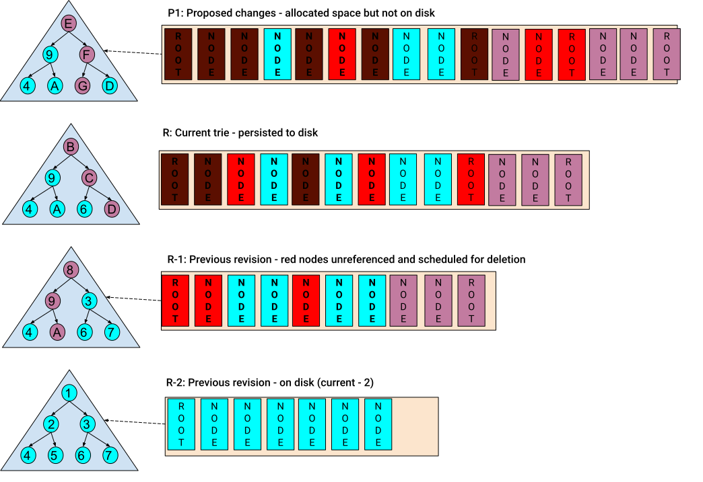

# Concepts & Architecture

Firewood uses the Merkle trie directly as its on-disk index. New roots are created
per revision; superseded nodes are tracked in a future-delete log and their space
returns to free lists once no live revision references them.

## Terminology

- **Revision** — a historical, point-in-time state of the trie, including all
  key/value pairs and nodes at that point.
- **View** — a read-only interface into a `Revision`, `Proposal`, or `Reconstructed`
  state.
- **Node** — a portion of the trie; nodes link to other nodes and/or hold key/value
  pairs.
- **Hash / Root Hash** — the Merkle hash of a node; the root hash is the hash of a
  revision's root node.
- **Key / Value** — the byte arrays a trie indexes; a zero-length value is valid.
- **Proof types** — a *key proof* attests a key exists in a revision; a *range proof*
  bounds a key range with two key proofs plus the pairs between them; a *change proof*
  is the set of changes between two revisions.
- **Batch / Batch Operation** — a `Put` or `Delete` is a batch operation; an ordered
  set of them is a batch.
- **Proposal** — a base root hash plus a batch, not yet committed. A proposal is
  required to commit.
- **Reconstructed** — a base historical state plus a batch applied in memory;
  read-only and not committable.
- **Commit** — applying one or more proposals to the most recent revision.

For the on-disk representation behind these concepts, see
[On-disk format and addressing](../designs/active/on-disk-format-and-addressing.md).
