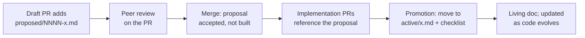

# Firewood mdBook Documentation Site — Design

- **Status:** approved
- **Date:** 2026-06-08
- **Author:** Brandon LeBlanc
- **Scope:** Documentation tooling, content scaffolding, and GitHub Pages CI

## Summary

Stand up an [mdBook](https://rust-lang.github.io/mdBook/) documentation site for
Firewood, deployed to GitHub Pages, and make it the front door of the published
site. The generated rustdoc, Go docs, and performance benchmark dashboards become
resources navigable *from* the book rather than the site root.

The book ships with an Introduction, a fully-authored Getting Started guide for
initializing development environments, and a Designs subsystem that establishes a
peer-reviewable, RFC-style workflow for proposing designs and promoting them to
living "active" documentation once implemented. Additional sections (Concepts,
AvalancheGo/EVM Integration, Operations & Benchmarking, Reference, Meta) each ship an
authored landing page; not-yet-written sub-pages are listed as mdBook draft chapters
(greyed-out sidebar entries) rather than empty stub files.

> [!NOTE]
> **Bootstrapping note.** This document is the first proposed design and is named
> accordingly: `docs/src/designs/proposed/0001-mdbook-documentation-site.md`. It is a
> chicken-and-egg artifact — the proposed-design workflow, templates, and `new-design`
> tooling it specifies do not exist until this work lands, so the convention cannot be
> fully applied to the document that defines it (for example, its frontmatter predates
> the template this design introduces). Placing it at `proposed/0001-*` anyway makes it
> a working example of the layout it proposes. Once the documentation system is
> implemented and this design is built, it is promoted to `active/` and the design of
> the documentation system itself becomes living documentation in the book's `meta/`
> section (see below).

## Goals

- Deploy an mdBook site to GitHub Pages with the book served at the site root.
- Demote generated rustdoc to `/rustdoc/`, navigable from the book.
- Keep Go docs (`/ffi/`) and benchmark dashboards (`/bench/`, `/dev/bench/`)
  reachable from the book without relocating them.
- Establish a design-doc workflow: propose → peer review → land → implement →
  promote to living documentation.
- Author a complete multi-environment developer setup guide.
- Make the book self-documenting: a `meta/` section documents the documentation
  system itself and scaffolds repository-process docs (release, contributing, code
  review).
- Scaffold remaining sections so they look intentional and are easy to expand.

## Non-Goals

- Backfilling every existing design. This MVP writes exactly one fully-realized
  active design (on-disk format & addressing) and lists the rest as TODO.
- Authoring full content for the scaffolded sections beyond an authored landing page;
  their deeper sub-pages remain draft chapters until written.
- Changing how benchmark data is collected or stored (`track-performance.yml` and
  the `benchmark-data` branch are unchanged).
- Custom mdBook theming beyond the preprocessor-provided assets and standard
  `book.toml` options.

## Background — current published-site layout

The `gh-pages.yaml` workflow assembles a single GitHub Pages deployment from
multiple sources:

- `cargo doc --document-private-items --no-deps` emits one top-level directory per
  documented target plus shared `static.files/`. There is no cargo-generated root
  `index.html`. rustdoc names each directory after the crate's *target* — the library
  name for lib crates, or the `[[bin]]` name for bin-only crates — with hyphens
  converted to underscores; it does **not** use the workspace-member path. The
  workspace has nine members. The seven library crates produce `firewood`,
  `firewood_storage` (the `storage` crate), `firewood_ffi` (`ffi`), `firewood_macros`,
  `firewood_metrics` (`metrics`), `firewood_triehash` (`triehash`), and
  `firewood_replay` (`replay` — it has a `lib.rs`, so its directory is `firewood_replay`,
  **not** `replay`). The two bin-only crates (`fwdctl`, `benchmark`) produce directories
  named after their `[[bin]]` targets: `fwdctl` and `benchmark`. Running `cargo doc
  --document-private-items --no-deps` confirms the full set — all nine target
  directories above plus rustdoc's shared `static.files/` and `src/` (source-view)
  directories, and no root `index.html`. Notably `firewood_ffi/` **is** emitted with its
  own `index.html` even though `firewood-ffi` is `crate-type = ["staticlib"]`; rustdoc
  documents its `[lib]` regardless.
- A hand-written step writes `target/doc/index.html` as a `<meta refresh>` redirect
  to `/firewood/`.
- `doc2go` emits Go docs to `/ffi/`.
- Benchmark history is fetched from the `benchmark-data` branch and merged into the
  output at `/bench/` (official, `main`) and `/dev/bench/{branch}/` (experimental).
- The `build` job hardcodes `ref: main` on checkout; the `deploy` job is gated to
  the canonical repo and non-`pull_request` events.

Because both rustdoc and mdBook want to own the site root (each emits `index.html`
and asset directories), making the book the root requires relocating cargo-doc
output into a subdirectory.

## Design decisions

1. **Site layout:** Book at site root; relocate cargo-doc output to `/rustdoc/`;
   leave `/ffi/` and `/bench/` unchanged.
2. **Book source location:** `docs/` is the mdBook root (`docs/book.toml`,
   `docs/src/`). Reuses the existing `docs/assets/architecture.svg` already
   referenced by `README.md`.
3. **CI strategy:** Extend the existing `gh-pages.yaml` rather than add a competing
   workflow (a separate workflow would race over the single-source Pages artifact).
4. **Design lifecycle:** File move between `proposed/` and `active/` folders is the
   visible status marker, backed by a documented promotion checklist (a frontmatter
   flip alone does not capture the work of promotion).
5. **Backfill scope:** Templates + one fully-written seed (`on-disk format &
   addressing`) + a TODO backfill index (in `active/README.md`) for the rest.
6. **Extra sections:** Concepts/Architecture, AvalancheGo/EVM Integration, Operations
   & Benchmarking, Reference (generated artifacts), and Meta (self-documenting docs +
   repository-process docs: release, contributing, code review). Sections with real
   seed content are authored at landing-page depth; sections (and sub-pages) without
   content yet are listed as mdBook **draft chapters** (link-less `SUMMARY.md` entries,
   which render as greyed-out/disabled sidebar items) rather than empty stub pages —
   see "Scaffolding via draft chapters" below.
7. **Preprocessors and callouts:** `mdbook-mermaid` (diagrams) is the only
   preprocessor. Its generated JS assets are **not** vendored; instead `mdbook-mermaid
   install docs` runs as part of every build (CI and the local `justfile` recipes), so
   there is no checked-in JS to drift. Callouts use mdBook's built-in alert syntax
   (`> [!NOTE]`, `> [!WARNING]`, …) rather than a preprocessor.
   > [!NOTE]
   > `mdbook-admonish` was the original choice for callouts, but it requires mdBook
   > `< 0.5.0`, which is incompatible with the `mdbook 0.5.x` that `mdbook-linkcheck2`
   > requires. mdBook 0.5's native alert syntax provides the same callouts with no
   > preprocessor, no checked-in CSS, and no asset-drift surface — so admonish is
   > dropped entirely.
8. **Install commands in docs:** The authored developer guide may include concrete
   install commands (`rustup`, `cargo install`, `brew install`, VS Code extensions).

## Architecture

### On-disk layout (book root = `docs/`)

```text
docs/
├── book.toml                  # mdBook config + mermaid preprocessor + linkcheck backend
├── mermaid.min.js             # generated at build time; git-ignored
├── mermaid-init.js            # generated at build time; git-ignored
└── src/
    ├── SUMMARY.md             # table of contents / sidebar (includes external link-outs)
    ├── assets/                # architecture.svg, relocated from docs/assets/ (see note below)
    ├── introduction.md
    ├── getting-started/
    │   ├── README.md          # section landing
    │   └── dev-environment.md # FULLY AUTHORED: macOS / Docker / remote SSH
    ├── concepts/
    │   └── README.md          # authored landing: promoted README terminology + architecture prose
    ├── designs/
    │   ├── README.md          # explains actual-vs-proposed model + how to propose + promotion checklist
    │   ├── templates/
    │   │   ├── proposed.md     # RFC-style template
    │   │   └── active.md       # living-doc template
    │   ├── active/
    │   │   ├── README.md       # index of current designs + TODO backfill list
    │   │   └── on-disk-format-and-addressing.md  # the one FULLY WRITTEN seed
    │   └── proposed/
    │       ├── README.md       # index of in-flight proposals
    │       └── 0001-mdbook-documentation-site.md  # this design (promoted to active/ once built)
    ├── integration/
    │   └── README.md          # authored: Go API (Database/Proposal/Revision) + firewood-go-ethhash publish relationship
    ├── operations/
    │   └── README.md          # authored landing: fwdctl, benchmarks, dashboards; links benchmark/docs/* + /bench/ (sub-pages are draft chapters until written)
    ├── reference/
    │   └── README.md          # authored landing: link-out hub for GENERATED artifacts: rustdoc ↗, godoc ↗, benchmarks ↗
    └── meta/
        ├── README.md          # authored landing: about this repo & these docs
        ├── documentation.md   # authored: how the docs work (mdbook, preprocessors, build/serve, authoring)
        └── release.md         # thin: links to RELEASE.md; + contributing/code-review pointers
```

> [!NOTE]
> Label vocabulary in this tree: **authored landing** = a real `README.md`/page with
> seed content, linked in `SUMMARY.md`; **thin** = a short real page that mostly links
> out; **draft chapter** = a `SUMMARY.md` entry written with empty link parentheses
> (`- [Title]()`), which has **no file** and renders greyed-out (see "Scaffolding via
> draft chapters"). Every section above ships an authored landing page at MVP; only
> not-yet-written *sub-pages* are draft chapters.

### Architecture diagram asset (relocation)

mdBook only copies non-Markdown files that live under `src/` into the rendered
output. The existing `docs/assets/architecture.svg` therefore moves to
`docs/src/assets/architecture.svg` so book pages can reference it with a relative
path (`./assets/architecture.svg` from `introduction.md`/`concepts/`). The repo-root
`README.md` reference is updated from `./docs/assets/architecture.svg` to
`./docs/src/assets/architecture.svg`. The `gh-pages.yaml` "Copy static assets" step
(`cp -rv docs/assets target/doc/`) is removed — mdBook now copies the asset into the
book output automatically.

### Deployed site URL map

```text
/                       → mdBook landing (introduction)
/getting-started/ …     → book pages
/concepts/ …            → book pages
/designs/ …             → book pages
/integration/ …         → book pages
/operations/ …          → book pages
/reference/ …           → book pages
/meta/ …                → book pages (about the repo & these docs)
/rustdoc/index.html     → redirect to firewood
/rustdoc/firewood/      → cargo doc (relocated from /firewood/)
/rustdoc/<other-target>/ → one dir per documented target (see Background for the exact set)
/ffi/                   → Go docs (doc2go, unchanged)
/bench/ , /dev/bench/…  → benchmark history (unchanged)
```

The `/rustdoc/index.html` redirect targets `firewood` only; the other crate
directories are reachable directly and via cross-links within rustdoc. Per-crate
redirect stubs at the *old* `/firewood/<crate>/` paths are **out of scope** for this
work — old external deep links 404, accepted in exchange for the cleaner root UX
(see Risks).

### How the book links to generated docs

`SUMMARY.md` supports raw-URL entries, which render as sidebar items. A
`reference/` section and sidebar entries link to the deployed paths
(`/firewood/rustdoc/`, `/firewood/ffi/`, `/firewood/bench/`). These resolve on the
deployed site; under local `mdbook serve` they point at the live production site.
The `reference/README.md` page notes this explicitly. `mdbook-linkcheck2` is
configured with `follow-web-links = false` so these external link-outs do not break
local/CI builds.

## Design-doc subsystem

### Model

Two states, two folders, one template each:

- **`proposed/`** — a design under peer review, not yet built. Named
  `NNNN-short-slug.md` (zero-padded sequence number for ordering and stable
  references in review threads). Typically lands in the repo *before* development so
  reviewers comment via normal PR review on the document — but this ordering is a
  recommendation, not a requirement.
- **`active/`** — a design that reflects what the code does today. Named
  `short-slug.md` (no number; it is a living document).

> [!NOTE]
> **This is a lightweight convention, not a mandatory gate.** The intent is to make
> design discussion and documentation easy and welcome — not to impose RFC rigor on
> every change. A `proposed/` doc is *encouraged* for significant or non-obvious
> designs, where writing it down sharpens the discussion; small, obvious, or low-risk
> changes do not need one, and nothing blocks a PR for lacking one. Authors may also
> write an `active/` design *after* the fact to document something already built. The
> templates exist to lower the cost of writing a design down, not as a checklist to
> satisfy. Optimize for "more designs discussed and recorded," not "process followed."

### Lifecycle



### Templates

**`templates/proposed.md`** (RFC-style). Frontmatter: `status: proposed`, `author`,
`created` (date), `tracking-issue`. Sections: Summary; Motivation; Guide-level
explanation; Detailed design; Drawbacks; Rationale & alternatives; Prior art;
Unresolved questions; Future possibilities.

**`templates/active.md`** (living doc). Frontmatter: `status: active`,
`last-reviewed` (date), `source` (links to modules/PRs it describes). Sections:
Overview; Architecture; Key data structures; Invariants & guarantees;
On-disk/runtime behavior; Trade-offs; Related designs. Prose uses imperative mood
and simple present tense.

### Promotion checklist (documented in `designs/README.md`)

1. `git mv proposed/NNNN-x.md active/x.md`.
2. Flip frontmatter `status: proposed` → `active`; drop proposal-only sections
   (Drawbacks, Unresolved questions), folding survivors into the active structure.
3. Rewrite future-tense prose into present tense — the design now describes reality.
4. Add cross-links to the implementing PR(s)/commits.
5. Register in `active/README.md` index; update `SUMMARY.md`.

### Seed design — `active/on-disk-format-and-addressing.md`

Fully written from `README.md` prose plus the `storage/` and `firewood/src/`
sources. Covers: disk-offset addressing (root address = disk offset; branch nodes
point to disk offsets), node allocation from end-of-file vs. free lists, free-list
size-class management, the future-delete log (FDL), and recoverability guarantees
(no references to new nodes before flush; careful free-list management across
revision creation/expiration).

### `active/README.md` backfill TODO list

Revision management; free lists & FDL; hashing (SHA-256 vs. ethhash/Keccak-256);
proposals & commits; archival mode (`RootStore`).

## CI/CD changes (`gh-pages.yaml`)

Output assembly moves from cargo-owned `target/doc/` into a staging directory
`site/` so mdBook owns root and rustdoc moves under `/rustdoc/`:

```text
site/                         ← uploaded as the Pages artifact
├── index.html + book pages   ← copied from docs/book/html/ (see step 4)
├── rustdoc/
│   ├── index.html            ← redirect → firewood
│   ├── firewood/ …           ← moved from cargo doc output
│   └── <other-target>/ …
├── ffi/                      ← doc2go (repointed to site/)
└── bench/ , dev/bench/…      ← merged from benchmark-data branch
```

### `build` job step changes

1. **Conditional checkout ref (bug fix).** Replace hardcoded `ref: main` with an
   explicit PR-head-aware expression:

   ```yaml
   ref: ${{ github.event_name == 'pull_request' && github.event.pull_request.head.sha || 'main' }}
   ```

   For `push`, `workflow_dispatch`, and `workflow_run` events this evaluates to
   `main` (docs always deploy from `main`); for `pull_request` it checks out the PR
   head so the new `docs/**` filter validates the PR's actual doc changes. This is
   deliberate: a `workflow_dispatch` triggered against a non-`main` branch still builds
   and deploys `main`'s docs, never the dispatched branch — the published site only ever
   reflects `main`.
2. **Install the mdBook toolchain.** `mdbook` and `mdbook-mermaid` install via
   `taiki-e/install-action` (pinned by commit SHA), each pinned to an explicit version.
   `mdbook-linkcheck2` is **not** in the `taiki-e/install-action` manifest, so install it
   with `cargo binstall --no-confirm mdbook-linkcheck2@<version>` (`cargo-binstall` itself
   comes from `taiki-e/install-action`). `cargo binstall` downloads a prebuilt binary when
   one is published for the runner target and **automatically falls back to
   `cargo install`** when no prebuilt artifact is available or the download fails (e.g.
   GitHub rate limiting), so no manual artifact-availability check or fallback step is
   required. All three tool versions are pinned and recorded. Because the mermaid assets
   are installed fresh from the pinned binary at build time (step 3) rather than vendored,
   there is no asset/binary version coupling to track by hand.
3. **Install preprocessor assets (not committed).** Run `mdbook-mermaid install docs`
   before building. The JS is generated fresh from the pinned binary on every build and
   the output paths are git-ignored, so there is nothing to drift; CI fails if the install
   errors.
4. **Build the book and stage HTML.** Run `mdbook build docs`. Because `book.toml`
   enables two renderers (`html` + `linkcheck`), mdBook writes HTML to
   `docs/book/html/` (not `docs/book/`). Create the staging dir and copy:
   `mkdir -p site && cp -r docs/book/html/. site/`. Then assert the site root exists
   before continuing: `test -s site/index.html` (fail the build otherwise). Since the
   hand-written root-redirect step is deleted (step 8) and `deploy` does not run on
   PRs, this is the only automated guard that the deployed site root resolves.
5. **Relocate rustdoc:** after `cargo doc`, `mkdir -p site/rustdoc && mv target/doc/*
   site/rustdoc/`, then write `site/rustdoc/index.html` redirect → `firewood`.
6. **Go docs:** repoint to `doc2go -C ffi -home github.com/ava-labs/firewood/ffi -out
   $(pwd)/site/ffi ./...`. Also pin the `doc2go` install (currently
   `go install go.abhg.dev/doc2go@latest`) to an explicit version for consistency with
   the newly pinned mdBook tools: `go install go.abhg.dev/doc2go@v0.12.2` (tag `v0.12.2`,
   commit `cb3c122f7e08194070fd4a8fce4466b2a7d74159`;
   [`github.com/abhinav/doc2go`](https://github.com/abhinav/doc2go)).
7. **Benchmark merge (scoped):** `git fetch origin benchmark-data`, then extract each
   of `bench` and `dev` *only if it exists* in `FETCH_HEAD`:

   ```bash
   for path in bench dev; do
     if git ls-tree -d --name-only FETCH_HEAD -- "$path" | grep -q .; then
       git archive FETCH_HEAD "$path" | tar -x -C site/
     fi
   done
   ```

   `track-performance.yml` populates the `benchmark-data` branch via
   `github-action-benchmark` (`auto-push: true`, `gh-pages-branch: benchmark-data`),
   writing official `main` history to `bench/` and experimental feature-branch history
   to `dev/bench/{branch}/`. Both are directories at the branch root, so `git ls-tree -d`
   is the correct existence test. Scoping the archive to those two paths — rather than
   the whole branch root, as the current workflow does with `git archive FETCH_HEAD |
   tar -x` — prevents the extract from clobbering the mdBook `index.html` or other book
   output now that the book, not rustdoc, owns the site root. The per-path existence
   check is required because `git archive FETCH_HEAD bench dev` **errors** (`pathspec
   'dev' did not match`) whenever `dev/` is absent — the branch's state until the first
   experimental feature-branch benchmark runs, since `track-performance.yml` currently
   publishes only `main` history (`bench/`). Keep the existing outer "branch may not
   exist on first run" guard wrapping the whole block.
8. **Delete** the hand-written root-redirect step and the "Copy static assets" step —
   mdBook emits the root `index.html` and copies `src/assets/` itself.
9. **Upload artifact** `path: site` (previously `target/doc`).

### Trigger change

Add `docs/**` to the `pull_request.paths` filter (the workflow-file path entry
stays). The `deploy` job's existing `github.event_name != 'pull_request'` guard keeps
PR runs build-only.

A docs-only PR therefore runs the *entire* site assembly (cargo doc, doc2go, benchmark
merge, mdBook build), not just `mdbook build`. This is **intentional**: validating the
full Pages artifact against the PR's changes is the point — it catches cross-component
breakage (e.g. a relocated rustdoc path, a broken `reference/` link-out, or an asset
collision in `site/`) before merge. The extra CI cost is an accepted trade for that
end-to-end coverage; the build is not split into a book-only fast path.

### Link checking

`mdbook-linkcheck2` runs as a backend during `mdbook build`, configured under
`[output.linkcheck2]` with `follow-web-links = false`. It validates internal book
links (broken `SUMMARY.md` entries, bad cross-references) without choking on the
external `/rustdoc/` link-outs that exist only post-deploy. Broken internal links fail
the PR build. Enabling this second renderer is what moves HTML output to
`docs/book/html/` (see build step 4).

`mdbook-linkcheck2` is a maintained fork of the original `mdbook-linkcheck`. The
original (last released 2022) rejects a `book.toml` whose `[rust]` table sets
`edition = "2024"` — the workspace default — failing with `unknown variant '2024'`;
the fork accepts it. The fork preserves the same link-checking behavior and also reads
the legacy `[output.linkcheck]` table name for backward compatibility.

### Post-deploy smoke check (automated)

Because linkcheck runs with `follow-web-links = false`, the `/rustdoc/`, `/ffi/`, and
`/bench/` link-outs from the `reference/` hub — the things most likely to rot after a
rustdoc relocation — are never validated by the build. A third job, `smoke`, is added
to `gh-pages.yaml`:

- `needs: [deploy]` so it runs only after a successful deploy.
- `if:` gated to the same condition as `deploy` (canonical repo, non-`pull_request`
  events) so PR runs and forks are unaffected.
- A single step that `curl --fail`s each deployed path — `/`, `/rustdoc/` (the
  redirect), `/rustdoc/firewood/`, `/ffi/`, and `/bench/` — against the Pages base URL,
  failing the workflow if any returns a non-success status.

This is the automated backstop for the consciously-skipped external link validation and
surfaces a stale crate-directory name (e.g. `firewood_replay`) introduced by a future
relocation.

### `book.toml` essentials

- `[build]`: leave `build-dir` at the default (`book`); with a second renderer
  enabled, mdBook writes each renderer to its own subdirectory, so HTML lands in
  `docs/book/html/` and link-check output in `docs/book/linkcheck2/` (only `html/` is
  copied into `site/`).
- `[output.html]`: `site-url = "/firewood/"` (used only for the generated 404 page's
  absolute links — normal pages use relative `path_to_root` links and render correctly
  both under local `mdbook serve` and at the `/firewood/` Pages base, so omitting or
  misconfiguring `site-url` breaks only the 404 page, not navigation),
  `git-repository-url`, `edit-url-template` (edit-on-GitHub links), `default-theme`,
  search enabled (default).
- `[preprocessor.mermaid]`. Its JS is produced by `mdbook-mermaid install docs` at build
  time (CI build step 3 and the `justfile` recipes) and is git-ignored, not committed.
  Callouts need no preprocessor — they use mdBook's native alert syntax (`> [!NOTE]`).
- `[output.linkcheck2]` with `follow-web-links = false`.

## Local tooling

### `justfile` recipes

- `book-assets` → `mdbook-mermaid install docs` (regenerates the git-ignored mermaid
  assets; a prerequisite of the build recipes so a fresh checkout builds without a
  manual step).
- `book-serve` → `book-assets` then `mdbook serve docs --open` (live reload).
- `book-build` → `book-assets` then `mdbook build docs` (mirrors what CI runs on PRs;
  this is the single build-and-validate recipe). `mdbook-linkcheck2` is a renderer
  backend, not a standalone binary, so it runs automatically as part of `mdbook build`
  once `[output.linkcheck2]` is configured in `book.toml` — there is no separate command
  to invoke.
- `new-design slug` → scaffolds `docs/src/designs/proposed/NNNN-slug.md` from the
  proposed template. Sequence-number algorithm: glob
  `docs/src/designs/proposed/[0-9][0-9][0-9][0-9]-*.md`, parse the leading 4-digit
  number from each, take the numeric maximum, add one, and zero-pad to four digits;
  if no matching files exist, start at `0001`. Gaps left by deleted/promoted files
  are not backfilled (numbers only ever increase). Two PRs that add a proposal
  concurrently compute the same next number and collide on merge; resolve it by
  renumbering the later proposal rather than treating it as a defect.

Recipes call `mdbook` directly; the dev-environment guide names the required tools
and links to upstream install docs (and may include concrete install commands).

### Getting Started — `dev-environment.md` (fully authored)

- **Common prerequisites:** `rustup` + pinned toolchain (MSRV 1.94.0, edition 2024),
  `just`, Go (FFI), Nix (FFI flake), the mdBook toolchain (`mdbook`,
  `mdbook-mermaid`, `mdbook-linkcheck2`).
- **macOS local:** rustup install; components (`rustfmt`, `clippy`, `rust-analyzer`);
  VS Code + `rust-analyzer` extension settings; `just` workflows; build/test
  (`cargo nextest run --workspace --features ethhash,logger`).
- **Docker / devcontainer:** use the existing `.devcontainer/`; open in VS Code Dev
  Containers; what is preinstalled vs. what to run.
- **Remote Linux over SSH:** VS Code Remote-SSH; install rustup/Go/Nix on the host;
  rust-analyzer running remotely; port-forwarding `mdbook serve` for live preview.
- **Verifying your setup:** the canonical build/test/clippy/doc commands from
  `CONTRIBUTING.md`.

### Scaffolding via draft chapters

mdBook supports **draft chapters** — `SUMMARY.md` entries written with empty link
parentheses (`- [Title]()`), which render as greyed-out/disabled items in the sidebar.
Per the mdBook guide their purpose is "to signal future chapters still to be written."
This is the idiomatic mdBook mechanism this design uses **instead of** creating empty
stub `.md` files (hollow pages would be search-indexed and present as real-but-empty
content). The rule:

- A section or sub-page with real seed content gets an authored landing page and a
  *linked* `SUMMARY.md` entry.
- A section or sub-page with nothing to say yet is a *draft chapter* (link-less entry):
  it shows in the outline as "coming soon" without creating a hollow page, and is
  promoted to a linked entry when its first real content lands.

Applying that rule to the extra sections (those with seed content are authored now;
the rest are draft chapters):

- `concepts/` — authored: seeded by promoting the README terminology + architecture-
  diagram prose.
- `integration/` — authored (this section has real material; see below). Documents the
  Go API surface and the AvalancheGo consumption story via FFI.
- `operations/` — authored landing page (`operations/README.md`) covering `fwdctl`
  usage, the C-Chain reexecution benchmark, and reading `/bench/` dashboards at a
  paragraph-each depth. The existing `benchmark/docs/cchain-reexecution.md` and
  `benchmark/docs/synthetic-workloads.md` are **linked to** (relative links to the
  GitHub-rendered files), not copied or `{{#include}}`-ed, for the MVP — this avoids
  duplicating content and avoids those files' site descriptions going stale against
  the new layout. Migrating their content into the book is a follow-up. The landing
  page links to `/bench/` for the live dashboards. **MVP scope:** exactly one file,
  `operations/README.md`; deeper sub-pages (e.g. `fwdctl.md`, `benchmarks.md`) are
  draft-chapter entries in `SUMMARY.md` (no files) until their content is written.
- `reference/` — authored landing page (`reference/README.md`): a link-out hub for
  *generated* artifacts only (rustdoc ↗, godoc ↗, benchmarks ↗). It is authored (the
  three link-outs are its content), not a draft chapter. Repository-process docs
  (CONTRIBUTING / RELEASE / CODE_REVIEW) live in the `meta/` section, not here.

### Integration & the Go API (`integration/`, authored)

This section has substantial, non-trivial material and is authored at MVP, not
drafted. Two things it must get right:

**1. The Go API surface.** The in-repo `ffi/` crate ships a Go wrapper. Its public
types map onto the Rust concepts as follows — note the Go names deliberately differ
from the Rust ones:

| Go type (`ffi/*.go`) | Rust concept | Notes |
| --- | --- | --- |
| `Database` (`firewood.go`) | `Db` | the database handle; there is **no** Go type named `Db` |
| `Proposal` (`proposal.go`) | `Proposal` | uncommitted batch atop a base root, awaiting commit |
| `Revision` (`revision.go`) | `DbView` | read-only view of a historical revision; `DbView` is the Rust-side name |
| `Reconstructed` (`reconstructed.go`) | reconstructed/archival view | state rebuilt incrementally from range proofs during state sync; released with `Drop` |
| `Iterator` (`iterator.go`) | view iterator | streams key/value pairs from a view; `Next` copies into Go memory, `NextBorrowed` lends Rust-owned memory |
| `BatchOp` (`batch_op.go`) | `BatchOp` | a single `Put`/`Delete`/`PrefixDelete`; the unit of a write batch |
| `RangeProof`, `ChangeProof`, `NextKeyRange` (`proofs.go`) | proof types | range/change proofs and key-range cursors used for state sync |

Construction and tuning options (`New`, the `With*` `Option`s) and the metrics/logging
entry points (`Gatherer`, `LogConfig`, `StartMetrics`, `StartLogs`) are documented
alongside the types they configure.

**2. The publish relationship (the part most likely to be missed).** AvalancheGo and
its grafts do **not** import the in-repo `ffi/` directory. They depend on the
*separately published* Go module `github.com/ava-labs/firewood-go-ethhash/ffi`, pinned
in `avalanchego/go.mod` and in the `graft/evm`, `graft/coreth`, and `graft/subnet-evm`
`go.mod`s. That published module tracks the `firewood-ffi` crate version: when
`firewood-ffi` is released, CI builds the static libraries, copies the in-repo `ffi/`
directory into the `ava-labs/firewood-go-ethhash` repository, and tags it (see
[`RELEASE.md`](../../../../RELEASE.md) and
[`.github/workflows/attach-static-libs.yaml`](../../../../.github/workflows/attach-static-libs.yaml)).
The section documents how the in-repo `ffi/` crate is built (the `cargo build` →
`go tool cgo` flow described in [`ffi/README.md`](../../../../ffi/README.md)), packaged,
and published, and how a downstream consumer pins and upgrades it. It links to `/ffi/`
(godoc) for the generated API reference and to `meta/release.md` for the publish/version
cadence. Without this, the integration story is incomplete: a reader following the
in-repo `ffi/` path would never find what AvalancheGo actually consumes.

### Meta section (self-documenting)

The `meta/` section makes the book document its own machinery and the repository's
processes:

- **`meta/documentation.md` (authored).** Seeded with the mdBook setup: the toolchain
  and preprocessors, the `docs/` layout, how to build/serve locally (`just book-serve`
  / `book-build`), how to add or edit a page and update `SUMMARY.md`,
  and a pointer to the design-doc workflow. This is the self-documenting core — a new
  contributor learns how the docs work from the docs themselves. It links to
  `getting-started/dev-environment.md` for tool installation rather than repeating it.
- **Repository-function pages (thin, link-out).** `meta/release.md` is a thin authored
  page documenting the release process — for the MVP it links to the canonical
  `RELEASE.md` (migrating the content into the book is a follow-up) — alongside
  link-out pointers to `CONTRIBUTING.md` and `CODE_REVIEW.md`. The section is structured
  so additional repository functions are easy to add as further thin pages or draft
  chapters.

This section resolves the bootstrapping note from the Summary: once implemented,
`meta/documentation.md` is the living record of how the documentation system works,
and this spec is its originating design artifact.

## Best practices applied (from the mdbook catalog review)

Distilled from the [`mdbooks.yaml` catalog](https://github.com/szabgab/mdbooks.code-maven.com/blob/95511782560de7bd1268f2f0af424a13fdd07f80/mdbooks.yaml)
(~120 mdBooks):

- `book.toml` + `src/SUMMARY.md` convention (universal).
- `mdbook-mermaid` for diagrams (Embedded Rust Book, Polkadot SDK Best Practices).
- RFC-style design docs (Rust RFC lineage).
- Edit-on-GitHub links + repo URL (Cargo book, mdBook guide).
- Search enabled by default.
- Link checking in CI (mdBook guide).
- A `reference/` link-out hub rather than burying generated API docs (common in
  tooling books).

## Testing & verification

- **CI build validation:** a PR touching `docs/**` triggers the `build` job, which
  runs `mdbook build docs` with the linkcheck backend; broken internal links fail.
- **Local:** `just book-build` reproduces the CI build + linkcheck.
- **Deploy smoke check (automated):** the `smoke` job (CI/CD changes above) runs after
  `deploy` on non-PR events and `curl --fail`s `/`, `/rustdoc/`, `/rustdoc/firewood/`,
  `/ffi/`, and `/bench/`, failing the workflow on any non-success status. The build job
  additionally asserts `site/index.html` exists before upload.
- **`new-design` recipe:** running it produces a correctly numbered proposed doc from
  the template.
- **Existing checks unaffected:** `cargo doc --no-deps`, `cargo fmt`, `cargo clippy`,
  and `cargo nextest` are unchanged; the repository's markdownlint check passes on the
  new Markdown. A book-scoped `docs/.markdownlint.json` disables `MD025` (multiple H1)
  and `MD042` (empty links) for mdBook's `SUMMARY.md` format; it lives outside `src/` so
  mdBook does not copy it into the rendered output.

## Acceptance criteria

- [ ] `docs/book.toml` + `docs/src/SUMMARY.md` exist; `mdbook build docs` succeeds
      locally with mermaid and linkcheck (internal links only); callouts use mdBook's
      native alert syntax (no admonish preprocessor).
- [ ] `gh-pages.yaml` copies the book HTML (`docs/book/html/`) into `site/`,
      relocates rustdoc to `site/rustdoc/` with a redirect index, repoints go docs to
      `site/ffi`, merges benchmark data with a per-path `git archive` (extracting
      `bench`/`dev` only if each exists in `FETCH_HEAD`), removes the old root-redirect
      and copy-static-assets steps, and uploads `site/`. `mdbook`, `mdbook-mermaid`,
      `mdbook-linkcheck2`, and `doc2go` are pinned to explicit versions; CI runs
      `mdbook-mermaid install docs` before building. The build job asserts
      `site/index.html` exists before upload.
- [ ] The hardcoded `ref: main` is replaced with a PR-head-aware checkout, and
      `docs/**` is added to the `pull_request.paths` filter; deploy stays gated to
      non-PR events on the canonical repo. A `smoke` job runs after `deploy` (non-PR
      events) and `curl --fail`s `/`, `/rustdoc/`, `/rustdoc/firewood/`, `/ffi/`, and
      `/bench/`.
- [ ] Introduction and a fully-authored `getting-started/dev-environment.md`
      (macOS, Docker, remote SSH) are written. *Structural completeness*
      (reviewer-checkable): every section contains the concrete install/build/verify
      commands from the outline.
- [ ] *Author sign-off* (recorded in the PR description, not a CI gate): the author has
      run the macOS and devcontainer command sequences end-to-end on a clean
      environment before merge; the remote-SSH section reuses the same commands and is
      reviewed for accuracy.
- [ ] `designs/` contains RFC-style `proposed` + `active` templates, a `README.md`
      documenting the model and promotion checklist, the fully-written
      `active/on-disk-format-and-addressing.md` seed, an `active/README.md` index
      with a backfill TODO list, and a `proposed/README.md` index.
- [ ] Sections with seed content (`concepts/`, `integration/`, `operations/`,
      `reference/`) have authored landing pages and linked `SUMMARY.md` entries;
      sections/sub-pages without content yet are mdBook draft chapters (link-less
      `SUMMARY.md` entries that render greyed-out), not empty `.md` files. `reference/`
      links only to generated artifacts (rustdoc/godoc/benchmarks). `integration/`
      documents the Go wrapper types (`Database`/`Proposal`/`Revision`, mapping to the
      Rust `Db`/`Proposal`/`DbView`) and the `firewood-go-ethhash` publish relationship
      that AvalancheGo actually consumes.
- [ ] A `meta/` section exists with an **authored** `documentation.md` (how the docs
      work: tooling, layout, build/serve, authoring, design workflow) and thin
      repository-function pages (`release.md` plus link-out pointers to CONTRIBUTING /
      CODE_REVIEW); the process-doc link-outs are in `meta/`, not `reference/`.
- [x] `justfile` gains `book-assets`, `book-serve`, and `book-build` (PR 1 — foundation).
- [ ] `justfile` gains a `new-design` recipe (PR 3 — content).
- [ ] Mermaid assets are installed at build time (not committed): CI and the
      `book-assets` recipe run `mdbook-mermaid install docs`, the generated asset paths
      are git-ignored, and a fresh checkout builds without a manual install step.
- [ ] `architecture.svg` is moved to `docs/src/assets/` and the root `README.md`
      reference is updated accordingly; the book renders the diagram.
- [ ] `markdownlint-cli2 .` passes.

## Accepted trade-off

- **Broken external deep links to `/firewood/<crate>`.** Relocating rustdoc to
  `/rustdoc/` breaks existing bookmarks/SEO to `…/firewood/firewood/…`. Mitigated by the
  `/rustdoc/` redirect index; per-crate redirect stubs at the old paths are out of scope
  (accepted 404s for the cleaner root UX) and remain a documented future option if the
  breakage proves painful.

### Verify at implementation time

- The generated 404 page's absolute links resolve on the `/firewood/` Pages base
  (`site-url`); normal pages use relative links and need no special handling.
