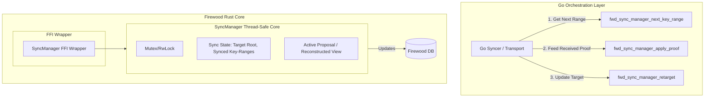

# Firewood State Sync Ownership: Design Specification & Implementation Plan

This document proposes a design and implementation plan to address synchronization flakiness in Firewood by replacing the Go-based, multi-lock orchestration (`merkledb/sync`) with a unified, Rust-native state management architecture.

## 1. Background & Problem Statement

In the current architecture, state synchronization progress is managed on the Go side across multiple locks:
*   A **target lock** (protecting the current synchronization target root hash).
*   A **work lock** (protecting the queue of pending ranges/keys to fetch).
*   Post-loop completion logic.

State synchronization operates by retrieving and verifying `RangeProof` and `ChangeProof` packets from peers. When the target changes mid-sync (the "moving-target" scenario):
1.  The Go orchestrator updates its target root.
2.  It attempts to reconcile or rebase the outstanding work.
3.  Due to the separation of the target state (in Go) and the database view/proposal states (in Firewood via the FFI), race conditions occur:
    *   **spurious "already-closed" errors**: Occur when a proposal or view is freed/dropped by one thread while another is still processing a range proof against it.
    *   **two-minute timeouts**: Occur when threads get blocked waiting on lock acquisition or channel notifications that never trigger due to lock order inversion or missing signals.

## 2. Proposed Architecture: Unified Rust-Native State Sync

To resolve these race conditions, we will centralize the sync state and target-change decisions within a single thread-safe manager, `SyncManager`, implemented in Firewood (Rust) and exposed via FFI.



### Key Concepts:
1.  **Single Lock Ownership**: All synchronization decisions (what key-range to fetch next, whether the sync is complete, how to process a new target root) are evaluated against a single consistent state behind a single lock inside the `SyncManager` in Rust.
2.  **Go as a Transport/Network Client**: The Go side no longer decides sync completion or target transitions. It queries the `SyncManager` for the next range of keys to fetch, requests the proof from the peer network, and submits the proof back to the `SyncManager`.
3.  **Atomic Retargeting**: When the node receives a new target, the Go side calls `fwd_sync_manager_retarget`. Inside the locked Rust core, the manager updates its target, invalidates or rebases any active proposals, and prepares to request change proofs or adjust the sync range without exposing intermediate invalid states to concurrent workers.

---

## 3. Rust-Side Design & Data Structures

We will implement a new module `firewood::sync` containing the core logic.

### 3.1 Core Structs

```rust
use std::sync::Arc;
use parking_lot::Mutex;
use firewood::api::{Db, DbView, HashKey, KeyRange};
use firewood::db::{Db as FirewoodDb, Proposal};

/// Represents the status of the synchronization process.
#[derive(Debug, Clone, PartialEq, Eq)]
pub enum SyncStatus {
    /// Syncing is in progress, returning the next range to fetch.
    InProgress(KeyRange),
    /// Synchronization is fully complete and matches the target root.
    Complete,
    /// Failed with a specific error.
    Failed(String),
}

/// Manages the state of synchronization.
pub struct SyncManagerInner {
    /// The database instance.
    db: Arc<FirewoodDb>,
    /// The target root hash we are syncing towards.
    target_root: HashKey,
    /// Current sync progress (e.g., the last successfully verified and committed key).
    last_synced_key: Option<Vec<u8>>,
    /// Active proposal containing the accumulated changes for the current sync target.
    active_proposal: Option<Proposal<'static>>,
    /// Flag indicating whether the sync is complete.
    is_complete: bool,
}

/// Thread-safe wrapper for the synchronization manager.
pub struct SyncManager {
    inner: Arc<Mutex<SyncManagerInner>>,
}
```

### 3.2 SyncManager Methods

```rust
impl SyncManager {
    /// Creates a new SyncManager with a starting target root.
    pub fn new(db: Arc<FirewoodDb>, target_root: HashKey) -> Self {
        Self {
            inner: Arc::new(Mutex::new(SyncManagerInner {
                db,
                target_root,
                last_synced_key: None,
                active_proposal: None,
                is_complete: false,
            })),
        }
    }

    /// Retargets the synchronization process to a new root hash.
    /// This is thread-safe and executes atomically.
    pub fn retarget(&self, new_target: HashKey) -> Result<(), firewood::api::Error> {
        let mut inner = self.inner.lock();
        if inner.target_root == new_target {
            return Ok(());
        }

        inner.target_root = new_target;
        inner.is_complete = false;

        // If we have an active proposal, we must rebase it or discard it.
        // For moving-target synchronization, we typically discard the active proposal
        // and prepare to apply change proofs between the old target and the new target,
        // or re-request the range proofs from the last synced key.
        if let Some(proposal) = inner.active_proposal.take() {
            // Discard the proposal by dropping it.
            drop(proposal);
        }

        Ok(())
    }

    /// Verifies and applies a range proof to the database under the active sync state.
    pub fn apply_range_proof(&self, proof: firewood::RangeProof) -> Result<SyncStatus, firewood::api::Error> {
        let mut inner = self.inner.lock();
        if inner.is_complete {
            return Ok(SyncStatus::Complete);
        }

        // Verify range proof against the target root hash.
        // We retrieve the start and end keys from the proof and merge the values.
        let start_key = inner.last_synced_key.as_deref();
        
        // Use Firewood's merge/proposal API to apply the range proof
        let db = inner.db.clone();
        let proposal = db.merge_key_value_range(start_key, None, proof.key_values())?;
        
        // Commit the proposal
        let committed_root = proposal.commit_with_rebase()?;
        
        // Update the last synced key based on the final key in the proof
        if let Some(last_kv) = proof.key_values().last() {
            inner.last_synced_key = Some(last_kv.key.to_vec());
        }

        // Check if sync is complete
        if committed_root.as_ref() == Some(&inner.target_root) {
            inner.is_complete = true;
            return Ok(SyncStatus::Complete);
        }

        // Find the next range to fetch
        let next_range = inner.determine_next_range()?;
        Ok(SyncStatus::InProgress(next_range))
    }
}
```

---

## 4. FFI Layer Extensions

 we will expose the `SyncManager` through the FFI in `ffi/src/lib.rs` and `ffi/src/sync.rs`.

### 4.1 C Types & Functions

```rust
// In ffi/src/sync.rs

pub struct SyncManagerContext {
    manager: firewood::sync::SyncManager,
}

#[unsafe(no_mangle)]
pub extern "C" fn fwd_sync_manager_new(
    db: Option<&DatabaseHandle>,
    target_root: crate::HashKey,
) -> *mut SyncManagerContext {
    // Instantiate SyncManager and return raw pointer
}

#[unsafe(no_mangle)]
pub extern "C" fn fwd_sync_manager_free(
    manager: *mut SyncManagerContext,
) {
    // Safely free the SyncManagerContext
}

#[unsafe(no_mangle)]
pub extern "C" fn fwd_sync_manager_retarget(
    manager: *mut SyncManagerContext,
    new_target: crate::HashKey,
) -> VoidResult {
    // Invoke retarget on the manager
}

#[unsafe(no_mangle)]
pub extern "C" fn fwd_sync_manager_apply_range_proof(
    manager: *mut SyncManagerContext,
    proof: *mut RangeProofContext,
) -> HashResult {
    // Apply range proof and return the new root hash or error
}
```

---

## 5. Go-Side Orchestrator Refactoring

In `avalanchego` or the Go wrapper package, the `Syncer` struct will be updated to:

```go
type Syncer struct {
    db          *Database
    syncManager *ffi.SyncManager
    // Remove: targetMu, workMu, activeProposals tracking
}

func (s *Syncer) Retarget(newTarget ids.ID) error {
    // Direct FFI call, atomic update in Rust
    return s.syncManager.Retarget(newTarget)
}

func (s *Syncer) SyncLoop(ctx context.Context) error {
    for {
        // Query next range from Rust
        nextRange, err := s.syncManager.NextKeyRange()
        if err != nil {
            return err
        }
        if nextRange == nil {
            // Done!
            break
        }

        // Fetch proof from peer
        proof, err := s.network.FetchRangeProof(ctx, nextRange)
        if err != nil {
            continue
        }

        // Apply proof to Rust SyncManager
        complete, err := s.syncManager.ApplyRangeProof(proof)
        if err != nil {
            return err
        }
        if complete {
            break
        }
    }
    return nil
}
```

---

## 6. Detailed Implementation Phases

### Phase 1: Rust Core Implementation (`firewood/src/sync.rs`)
1.  Implement the `SyncManager` struct and locking primitives using `parking_lot::Mutex`.
2.  Integrate target state and progress tracking.
3.  Implement `apply_range_proof` and `apply_change_proof` helper methods.

### Phase 2: FFI Exposure (`ffi/src/sync.rs` & C headers)
1.  Create `SyncManagerContext` to wrap `SyncManager`.
2.  Expose FFI functions for creation, retargeting, proof application, progress querying, and destruction.
3.  Update FFI header files (`firewood.h`).

### Phase 3: Go FFI Bindings (`ffi/sync.go`)
1.  Create Go wrapper structures for `SyncManager`.
2.  Implement methods wrapping C-FFI calls.
3.  Manage memory lifetimes through proper Go garbage collection and `runtime.SetFinalizer`.

### Phase 4: Integration & Tests (`ffi/tests/firewood/merkle_compatibility_test.go`)
1.  Refactor existing mock-sync or compatibility tests to utilize the new `SyncManager` interface.
2.  Implement a dedicated moving-target race condition test where retargeting is executed concurrently with proof commits to guarantee no timeouts or deadlocks occur.
