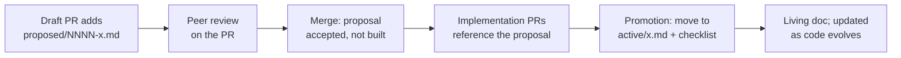

# Firewood mdBook Documentation Site — Design

- **Status:** pending peer review
- **Date:** 2026-06-08
- **Author:** Brandon LeBlanc
- **Scope:** Documentation tooling, content scaffolding, and GitHub Pages CI

## Summary

Stand up an [mdBook](https://rust-lang.github.io/mdBook/) documentation site for
Firewood, deployed to GitHub Pages, and make it the front door of the published
site. The generated rustdoc, Go docs, and performance benchmark dashboards become
resources navigable *from* the book rather than the site root.

The book ships with an Introduction, a fully-authored Getting Started guide for
initializing development environments, and a Designs subsystem that establishes a
peer-reviewable, RFC-style workflow for proposing designs and promoting them to
living "active" documentation once implemented. Additional sections (Concepts,
AvalancheGo/EVM Integration, Operations & Benchmarking, Reference, Meta) are
scaffolded with intentional stubs.

> [!NOTE]
> **Bootstrapping note.** This spec does not itself follow the design-doc convention
> it establishes — it lives under `docs/superpowers/specs/` rather than
> `docs/src/designs/proposed/NNNN-*.md`. This is the bootstrap problem: the
> proposed-design workflow, templates, and `new-design` tooling do not exist until
> this work lands, so the process cannot be applied to the document that defines it.
> Once the documentation system is implemented, the design of the documentation
> system itself lives in the book's `meta/` section (see below), and this spec is
> recorded there as the originating artifact.

## Goals

- Deploy an mdBook site to GitHub Pages with the book served at the site root.
- Demote generated rustdoc to `/rustdoc/`, navigable from the book.
- Keep Go docs (`/ffi/`) and benchmark dashboards (`/bench/`, `/dev/bench/`)
  reachable from the book without relocating them.
- Establish a design-doc workflow: propose → peer review → land → implement →
  promote to living documentation.
- Author a complete multi-environment developer setup guide.
- Make the book self-documenting: a `meta/` section documents the documentation
  system itself and scaffolds repository-process docs (release, contributing, code
  review).
- Scaffold remaining sections so they look intentional and are easy to expand.

## Non-Goals

- Backfilling every existing design. This MVP writes exactly one fully-realized
  active design (on-disk format & addressing) and lists the rest as TODO.
- Authoring full content for the stub sections beyond a landing page and example
  structure.
- Changing how benchmark data is collected or stored (`track-performance.yml` and
  the `benchmark-data` branch are unchanged).
- Custom mdBook theming beyond the preprocessor-provided assets and standard
  `book.toml` options.

## Background — current published-site layout

The `gh-pages.yaml` workflow assembles a single GitHub Pages deployment from
multiple sources:

- `cargo doc --document-private-items --no-deps` emits one top-level directory per
  workspace crate plus shared `static.files/`. There is no cargo-generated root
  `index.html`. The workspace has nine members, so the rustdoc output contains
  directories for `benchmark`, `firewood`, `firewood_ffi` (the `ffi` crate),
  `firewood_macros`, `firewood_metrics` (the `metrics` crate), `firewood_storage`
  (the `storage` crate), `firewood_triehash` (the `triehash` crate), `fwdctl`, and
  `replay` (exact crate→directory names to be confirmed against `cargo doc` output
  during implementation).
- A hand-written step writes `target/doc/index.html` as a `<meta refresh>` redirect
  to `/firewood/`.
- `doc2go` emits Go docs to `/ffi/`.
- Benchmark history is fetched from the `benchmark-data` branch and merged into the
  output at `/bench/` (official, `main`) and `/dev/bench/{branch}/` (experimental).
- The `build` job hardcodes `ref: main` on checkout; the `deploy` job is gated to
  the canonical repo and non-`pull_request` events.

Because both rustdoc and mdBook want to own the site root (each emits `index.html`
and asset directories), making the book the root requires relocating cargo-doc
output into a subdirectory.

## Decisions (resolved during brainstorming)

1. **Site layout:** Book at site root; relocate cargo-doc output to `/rustdoc/`;
   leave `/ffi/` and `/bench/` unchanged.
2. **Book source location:** `docs/` is the mdBook root (`docs/book.toml`,
   `docs/src/`). Reuses the existing `docs/assets/architecture.svg` already
   referenced by `README.md`.
3. **CI strategy:** Extend the existing `gh-pages.yaml` rather than add a competing
   workflow (a separate workflow would race over the single-source Pages artifact).
4. **Design lifecycle:** File move between `proposed/` and `active/` folders is the
   visible status marker, backed by a documented promotion checklist (a frontmatter
   flip alone does not capture the work of promotion).
5. **Backfill scope:** Templates + one fully-written seed (`on-disk format &
   addressing`) + stubs/TODO index for the rest.
6. **Extra sections (all scaffolded):** Concepts/Architecture, AvalancheGo/EVM
   Integration, Operations & Benchmarking, Reference (generated artifacts), and Meta
   (self-documenting docs + repository-process docs: release, contributing, code
   review).
7. **Preprocessors:** `mdbook-mermaid` (diagrams) and `mdbook-admonish` (callouts);
   their generated CSS/JS assets are committed to the repo.
8. **Install commands in docs:** The authored developer guide may include concrete
   install commands (`rustup`, `cargo install`, `brew install`, VS Code extensions).

## Architecture

### On-disk layout (book root = `docs/`)

```text
docs/
├── book.toml                  # mdBook config + preprocessors + linkcheck backend
├── theme/                     # committed mermaid/admonish assets + custom head includes
└── src/
    ├── SUMMARY.md             # table of contents / sidebar (includes external link-outs)
    ├── assets/                # architecture.svg, relocated from docs/assets/ (see note below)
    ├── introduction.md
    ├── getting-started/
    │   ├── README.md          # section landing
    │   └── dev-environment.md # FULLY AUTHORED: macOS / Docker / remote SSH
    ├── concepts/
    │   └── README.md          # stub: promoted README terminology + architecture prose
    ├── designs/
    │   ├── README.md          # explains actual-vs-proposed model + how to propose + promotion checklist
    │   ├── templates/
    │   │   ├── proposed.md     # RFC-style template
    │   │   └── active.md       # living-doc template
    │   ├── active/
    │   │   ├── README.md       # index of current designs + TODO backfill list
    │   │   └── on-disk-format-and-addressing.md  # the one FULLY WRITTEN seed
    │   └── proposed/
    │       └── README.md       # index of in-flight proposals (none yet)
    ├── integration/
    │   └── README.md          # stub: AvalancheGo / libevm via FFI
    ├── operations/
    │   └── README.md          # stub: fwdctl, benchmarks, dashboards; folds in benchmark/docs/*
    ├── reference/
    │   └── README.md          # link-out hub for GENERATED artifacts: rustdoc ↗, godoc ↗, benchmarks ↗
    └── meta/
        ├── README.md          # section landing: about this repo & these docs
        ├── documentation.md   # AUTHORED: how the docs work (mdbook, preprocessors, build/serve, authoring)
        └── release.md         # stub: release process (links/migrates RELEASE.md); + contributing/code-review pointers
```

### Architecture diagram asset (relocation)

mdBook only copies non-Markdown files that live under `src/` into the rendered
output. The existing `docs/assets/architecture.svg` therefore moves to
`docs/src/assets/architecture.svg` so book pages can reference it with a relative
path (`./assets/architecture.svg` from `introduction.md`/`concepts/`). The repo-root
`README.md` reference is updated from `./docs/assets/architecture.svg` to
`./docs/src/assets/architecture.svg`. The `gh-pages.yaml` "Copy static assets" step
(`cp -rv docs/assets target/doc/`) is removed — mdBook now copies the asset into the
book output automatically.

### Deployed site URL map

```text
/                       → mdBook landing (introduction)
/getting-started/ …     → book pages
/concepts/ …            → book pages
/designs/ …             → book pages
/integration/ …         → book pages
/operations/ …          → book pages
/reference/ …           → book pages
/meta/ …                → book pages (about the repo & these docs)
/rustdoc/index.html     → redirect to firewood
/rustdoc/firewood/      → cargo doc (relocated from /firewood/)
/rustdoc/<other-crate>/ → one dir per workspace crate (see Background for the full set)
/ffi/                   → Go docs (doc2go, unchanged)
/bench/ , /dev/bench/…  → benchmark history (unchanged)
```

The `/rustdoc/index.html` redirect targets `firewood` only; the other crate
directories are reachable directly and via cross-links within rustdoc. Per-crate
redirect stubs at the *old* `/firewood/<crate>/` paths are **out of scope** for this
work — old external deep links 404, accepted in exchange for the cleaner root UX
(see Risks).

### How the book links to generated docs

`SUMMARY.md` supports raw-URL entries, which render as sidebar items. A
`reference/` section and sidebar entries link to the deployed paths
(`/firewood/rustdoc/`, `/firewood/ffi/`, `/firewood/bench/`). These resolve on the
deployed site; under local `mdbook serve` they point at the live production site.
The `reference/README.md` page notes this explicitly. `mdbook-linkcheck` is
configured with `follow-web-links = false` so these external link-outs do not break
local/CI builds.

## Design-doc subsystem

### Model

Two states, two folders, one template each:

- **`proposed/`** — a design under peer review, not yet built. Named
  `NNNN-short-slug.md` (zero-padded sequence number for ordering and stable
  references in review threads). Lands in the repo *before* development so reviewers
  comment via normal PR review on the document.
- **`active/`** — a design that reflects what the code does today. Named
  `short-slug.md` (no number; it is a living document).

### Lifecycle



### Templates

**`templates/proposed.md`** (RFC-style). Frontmatter: `status: proposed`, `author`,
`created` (date), `tracking-issue`. Sections: Summary; Motivation; Guide-level
explanation; Detailed design; Drawbacks; Rationale & alternatives; Prior art;
Unresolved questions; Future possibilities.

**`templates/active.md`** (living doc). Frontmatter: `status: active`,
`last-reviewed` (date), `source` (links to modules/PRs it describes). Sections:
Overview; Architecture; Key data structures; Invariants & guarantees;
On-disk/runtime behavior; Trade-offs; Related designs. Prose uses imperative mood
and simple present tense.

### Promotion checklist (documented in `designs/README.md`)

1. `git mv proposed/NNNN-x.md active/x.md`.
2. Flip frontmatter `status: proposed` → `active`; drop proposal-only sections
   (Drawbacks, Unresolved questions), folding survivors into the active structure.
3. Rewrite future-tense prose into present tense — the design now describes reality.
4. Add cross-links to the implementing PR(s)/commits.
5. Register in `active/README.md` index; update `SUMMARY.md`.

### Seed design — `active/on-disk-format-and-addressing.md`

Fully written from `README.md` prose plus the `storage/` and `firewood/src/`
sources. Covers: disk-offset addressing (root address = disk offset; branch nodes
point to disk offsets), node allocation from end-of-file vs. free lists, free-list
size-class management, the future-delete log (FDL), and recoverability guarantees
(no references to new nodes before flush; careful free-list management across
revision creation/expiration).

### `active/README.md` backfill TODO list

Revision management; free lists & FDL; hashing (SHA-256 vs. ethhash/Keccak-256);
proposals & commits; archival mode (`RootStore`).

## CI/CD changes (`gh-pages.yaml`)

Output assembly moves from cargo-owned `target/doc/` into a staging directory
`site/` so mdBook owns root and rustdoc moves under `/rustdoc/`:

```text
site/                         ← uploaded as the Pages artifact
├── index.html + book pages   ← copied from docs/book/html/ (see step 4)
├── rustdoc/
│   ├── index.html            ← redirect → firewood
│   ├── firewood/ …           ← moved from cargo doc output
│   └── <other-crate>/ …
├── ffi/                      ← doc2go (repointed to site/)
└── bench/ , dev/bench/…      ← merged from benchmark-data branch
```

### `build` job step changes

1. **Conditional checkout ref (bug fix).** Replace hardcoded `ref: main` with an
   explicit PR-head-aware expression:

   ```yaml
   ref: ${{ github.event_name == 'pull_request' && github.event.pull_request.head.sha || 'main' }}
   ```

   For `push`, `workflow_dispatch`, and `workflow_run` events this evaluates to
   `main` (docs always deploy from `main`); for `pull_request` it checks out the PR
   head so the new `docs/**` filter validates the PR's actual doc changes.
2. **Install the mdBook toolchain.** `mdbook`, `mdbook-mermaid`, and
   `mdbook-linkcheck` install via `taiki-e/install-action` (pinned by commit SHA),
   each pinned to an explicit version. `mdbook-admonish` is **not** in the
   `taiki-e/install-action` manifest, so install it with `cargo binstall --no-confirm
   mdbook-admonish@<version>` (`cargo-binstall` itself comes from
   `taiki-e/install-action`). All four tool versions are pinned and recorded; the
   pinned `mdbook-admonish` version must match the version that generated the
   committed admonish assets.
3. **Regenerate admonish assets (idempotent guard).** Run `mdbook-admonish install
   docs` before building so the committed CSS matches the pinned binary; CI fails if
   this step errors.
4. **Build the book and stage HTML.** Run `mdbook build docs`. Because `book.toml`
   enables two renderers (`html` + `linkcheck`), mdBook writes HTML to
   `docs/book/html/` (not `docs/book/`). Create the staging dir and copy:
   `mkdir -p site && cp -r docs/book/html/. site/`.
5. **Relocate rustdoc:** after `cargo doc`, `mkdir -p site/rustdoc && mv target/doc/*
   site/rustdoc/`, then write `site/rustdoc/index.html` redirect → `firewood`.
6. **Go docs:** repoint to `doc2go -C ffi -home github.com/ava-labs/firewood/ffi -out
   $(pwd)/site/ffi ./...`. Also pin the `doc2go` install (currently
   `go install go.abhg.dev/doc2go@latest`) to an explicit version for consistency
   with the newly pinned mdBook tools.
7. **Benchmark merge (scoped):** `git fetch origin benchmark-data` then
   `git archive FETCH_HEAD bench dev | tar -x -C site/`. Scoping the archive to the
   `bench` and `dev` paths (rather than the whole branch root) prevents the extract
   from clobbering the mdBook `index.html` or other book output. Preserve the
   existing "branch may not exist on first run" guard.
8. **Delete** the hand-written root-redirect step and the "Copy static assets" step —
   mdBook emits the root `index.html` and copies `src/assets/` itself.
9. **Upload artifact** `path: site` (previously `target/doc`).

### Trigger change

Add `docs/**` to the `pull_request.paths` filter (the workflow-file path entry
stays). The `deploy` job's existing `github.event_name != 'pull_request'` guard keeps
PR runs build-only.

### Link checking

`mdbook-linkcheck` runs as a backend during `mdbook build`, configured
`follow-web-links = false`. It validates internal book links (broken `SUMMARY.md`
entries, bad cross-references) without choking on the external `/rustdoc/` link-outs
that exist only post-deploy. Broken internal links fail the PR build. Enabling this
second renderer is what moves HTML output to `docs/book/html/` (see build step 4).

### `book.toml` essentials

- `[build]`: leave `build-dir` at the default (`book`); with the linkcheck renderer
  enabled, HTML lands in `docs/book/html/`.
- `[output.html]`: `site-url = "/firewood/"` (used only for the generated 404 page's
  absolute links — normal pages use relative `path_to_root` links and render
  correctly both under local `mdbook serve` and at the `/firewood/` Pages base),
  `git-repository-url`, `edit-url-template` (edit-on-GitHub links), `default-theme`,
  search enabled (default).
- `[preprocessor.mermaid]` and `[preprocessor.admonish]`. `mdbook-admonish install
  docs` is run once locally to drop CSS into the book; the generated assets are
  committed and re-verified in CI (build step 3).
- `[output.linkcheck]` with `follow-web-links = false`.

## Local tooling

### `justfile` recipes

- `book-serve` → `mdbook serve docs --open` (live reload).
- `book-build` → `mdbook build docs` (mirrors CI's internal build).
- `book-check` → build + `mdbook-linkcheck` pass (what CI runs on PRs).
- `new-design slug` → scaffolds `docs/src/designs/proposed/NNNN-slug.md` from the
  proposed template. Sequence-number algorithm: glob
  `docs/src/designs/proposed/[0-9][0-9][0-9][0-9]-*.md`, parse the leading 4-digit
  number from each, take the numeric maximum, add one, and zero-pad to four digits;
  if no matching files exist, start at `0001`. Gaps left by deleted/promoted files
  are not backfilled (numbers only ever increase).

Recipes call `mdbook` directly; the dev-environment guide names the required tools
and links to upstream install docs (and may include concrete install commands).

### Getting Started — `dev-environment.md` (fully authored)

- **Common prerequisites:** `rustup` + pinned toolchain (MSRV 1.94.0, edition 2024),
  `just`, Go (FFI), Nix (FFI flake), the mdBook toolchain (`mdbook`,
  `mdbook-mermaid`, `mdbook-admonish`, `mdbook-linkcheck`).
- **macOS local:** rustup install; components (`rustfmt`, `clippy`, `rust-analyzer`);
  VS Code + `rust-analyzer` extension settings; `just` workflows; build/test
  (`cargo nextest run --workspace --features ethhash,logger`).
- **Docker / devcontainer:** use the existing `.devcontainer/`; open in VS Code Dev
  Containers; what is preinstalled vs. what to run.
- **Remote Linux over SSH:** VS Code Remote-SSH; install rustup/Go/Nix on the host;
  rust-analyzer running remotely; port-forwarding `mdbook serve` for live preview.
- **Verifying your setup:** the canonical build/test/clippy/doc commands from the
  `CLAUDE.md` PR checklist.

### Stub sections

Each stub is a real landing page: short intro + a few example subheadings + an
admonish callout indicating it is a scaffold to expand.

- `concepts/` — seeded by promoting the README terminology + architecture-diagram
  prose.
- `integration/` — AvalancheGo/libevm via FFI: how the Go wrapper maps to the Rust
  `Db`/`Proposal`/`DbView`; links to `/ffi/`.
- `operations/` — `fwdctl` usage, the C-Chain reexecution benchmark, reading
  `/bench/` dashboards. The existing `benchmark/docs/cchain-reexecution.md` and
  `benchmark/docs/synthetic-workloads.md` are **linked to** (relative links to the
  GitHub-rendered files), not copied or `{{#include}}`-ed, for the MVP — this avoids
  duplicating content and avoids those files' site descriptions going stale against
  the new layout. Migrating their content into the book is a follow-up. The
  `operations/` landing page links to `/bench/` for the live dashboards.
- `reference/` — link-out hub for *generated* artifacts only (rustdoc ↗, godoc ↗,
  benchmarks ↗). Repository-process docs (CONTRIBUTING / RELEASE / CODE_REVIEW) live
  in the `meta/` section, not here.

### Meta section (self-documenting)

The `meta/` section makes the book document its own machinery and the repository's
processes:

- **`meta/documentation.md` (authored).** Seeded with the mdBook setup: the toolchain
  and preprocessors, the `docs/` layout, how to build/serve locally (`just book-serve`
  / `book-build` / `book-check`), how to add or edit a page and update `SUMMARY.md`,
  and a pointer to the design-doc workflow. This is the self-documenting core — a new
  contributor learns how the docs work from the docs themselves. It links to
  `getting-started/dev-environment.md` for tool installation rather than repeating it.
- **Repository-function scaffolds (stubs).** `meta/release.md` documents the release
  process (for the MVP it links to the canonical `RELEASE.md`; migrating the content
  into the book is a follow-up), alongside stubbed pointers to `CONTRIBUTING.md` and
  `CODE_REVIEW.md`. The section is structured so additional repository functions are
  easy to add.

This section resolves the bootstrapping note from the Summary: once implemented,
`meta/documentation.md` is the living record of how the documentation system works,
and this spec is its originating design artifact.

## Best practices applied (from the mdbook catalog review)

Distilled from `~/src/mdbooks.code-maven.com/mdbooks.yaml` (~120 mdBooks):

- `book.toml` + `src/SUMMARY.md` convention (universal).
- `mdbook-mermaid` for diagrams (Embedded Rust Book, Polkadot SDK Best Practices).
- RFC-style design docs (Rust RFC lineage).
- Edit-on-GitHub links + repo URL (Cargo book, mdBook guide).
- Search enabled by default.
- Link checking in CI (mdBook guide).
- A `reference/` link-out hub rather than burying generated API docs (common in
  tooling books).

## Testing & verification

- **CI build validation:** a PR touching `docs/**` triggers the `build` job, which
  runs `mdbook build docs` with the linkcheck backend; broken internal links fail.
- **Local:** `just book-check` reproduces the CI build + linkcheck.
- **Deploy smoke check:** after merge to `main`, verify the deployed site serves the
  book at `/`, rustdoc at `/rustdoc/firewood/`, `/rustdoc/` redirects to `firewood`,
  go docs at `/ffi/`, and benchmarks at `/bench/`.
- **`new-design` recipe:** running it produces a correctly numbered proposed doc from
  the template.
- **Existing checks unaffected:** `cargo doc --no-deps`, `cargo fmt`, `cargo clippy`,
  and `cargo nextest` are unchanged; `markdownlint-cli2 .` passes on the new Markdown.

## Acceptance criteria

- [ ] `docs/book.toml` + `docs/src/SUMMARY.md` exist; `mdbook build docs` succeeds
      locally with mermaid, admonish, and linkcheck (internal links only).
- [ ] `gh-pages.yaml` copies the book HTML (`docs/book/html/`) into `site/`,
      relocates rustdoc to `site/rustdoc/` with a redirect index, repoints go docs to
      `site/ffi`, merges benchmark data with a path-scoped
      `git archive FETCH_HEAD bench dev`, removes the old root-redirect and
      copy-static-assets steps, and uploads `site/`. `mdbook`, `mdbook-mermaid`,
      `mdbook-linkcheck`, `mdbook-admonish`, and `doc2go` are pinned to explicit
      versions; CI runs `mdbook-admonish install docs` before building.
- [ ] The hardcoded `ref: main` is replaced with a PR-head-aware checkout, and
      `docs/**` is added to the `pull_request.paths` filter; deploy stays gated to
      non-PR events on the canonical repo.
- [ ] Introduction and a fully-authored `getting-started/dev-environment.md`
      (macOS, Docker, remote SSH) are written. "Fully authored" means every section
      contains the concrete install/build/verify commands from the outline, and the
      author has run the macOS and devcontainer command sequences end-to-end on a
      clean environment before merge (the remote-SSH section reuses the same commands
      and is reviewed for accuracy).
- [ ] `designs/` contains RFC-style `proposed` + `active` templates, a `README.md`
      documenting the model and promotion checklist, the fully-written
      `active/on-disk-format-and-addressing.md` seed, an `active/README.md` index
      with a backfill TODO list, and a `proposed/README.md` index.
- [ ] `concepts/`, `integration/`, `operations/`, and `reference/` stubs each have an
      intentional landing page and appear in `SUMMARY.md`; `reference/` links only to
      generated artifacts (rustdoc/godoc/benchmarks).
- [ ] A `meta/` section exists with an **authored** `documentation.md` (how the docs
      work: tooling, layout, build/serve, authoring, design workflow) and stubbed
      repository-function pages (`release.md` plus pointers to CONTRIBUTING /
      CODE_REVIEW); the process-doc link-outs are in `meta/`, not `reference/`.
- [ ] `justfile` gains `book-serve`, `book-build`, `book-check`, and `new-design`.
- [ ] Generated admonish/mermaid assets are committed.
- [ ] `architecture.svg` is moved to `docs/src/assets/` and the root `README.md`
      reference is updated accordingly; the book renders the diagram.
- [ ] `markdownlint-cli2 .` passes.

## Risks & open questions

- **Broken external deep links to `/firewood/<crate>`.** Relocating rustdoc to
  `/rustdoc/` breaks existing bookmarks/SEO to
  `https://ava-labs.github.io/firewood/firewood/...`. Mitigation: the `/rustdoc/`
  redirect index. Per-crate redirect stubs at the old paths are explicitly out of
  scope (accepted 404s for the cleaner root UX); a CI step writing such stubs remains
  a documented future option if the breakage proves painful.
- **`mdbook-admonish` is not in `taiki-e/install-action`.** Resolved: install it via
  `cargo binstall` (with `cargo-binstall` itself provided by `taiki-e/install-action`),
  pinned to the version that generated the committed assets. Verify `cargo-binstall`
  has a prebuilt artifact for the chosen `mdbook-admonish` version at implementation
  time; otherwise fall back to a versioned GitHub Releases download.
- **`site-url` and local serve.** `site-url = "/firewood/"` affects only the generated
  404 page; normal pages use relative links and render correctly both locally and at
  the `/firewood/` base. No special local-serve handling is required for normal pages.
  Verify the 404 page links resolve on the deployed base.
- **Admonish asset drift.** Committed admonish CSS can fall out of sync with the
  pinned `mdbook-admonish` version. Mitigation: CI runs `mdbook-admonish install docs`
  with the pinned binary before building (build step 3), so a drift surfaces as a
  failed/dirty build.
- **Multi-renderer output path.** Enabling both the `html` and `linkcheck` renderers
  moves HTML output to `docs/book/html/`; the CI copy step and any local tooling must
  target that path, not `docs/book/`. Captured in build step 4.
